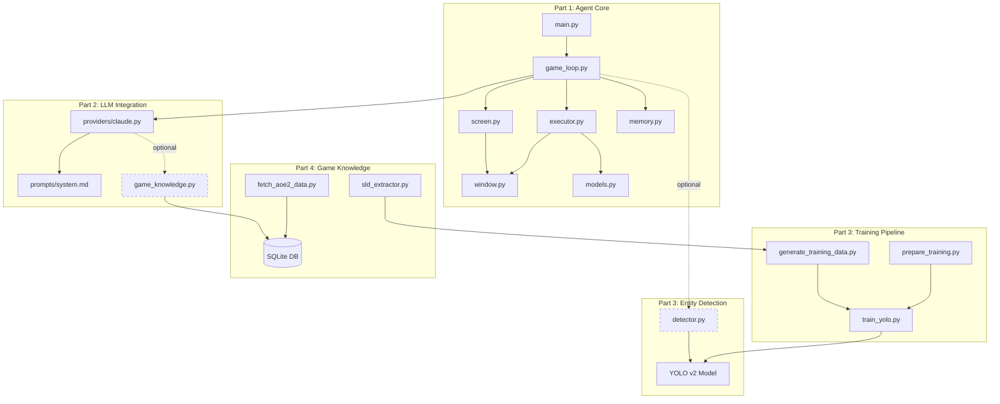

# AoE2 LLM Arena - Technical Documentation

A vision-based AI agent that plays Age of Empires II: Definitive Edition by capturing screenshots, analyzing them with Claude Vision, and executing game actions through mouse/keyboard automation. The system optionally augments Claude's vision with YOLO object detection for precise entity targeting and injects dynamic game knowledge from a structured database.

---

## Architecture Overview

Dashed lines indicate optional dependencies. The agent runs without YOLO detection or game knowledge -- both are additive enhancements.

---

## Table of Contents

### Part 1: Architecture

| # | Chapter | Description | Key Files |
|---|---------|-------------|-----------|
| 01 | [System Overview](./part1-architecture/01-system-overview.md) | High-level design, graceful degradation, async architecture | `config.py`, `main.py` |
| 02 | [Game Loop Pipeline](./part1-architecture/02-game-loop-pipeline.md) | The capture-detect-think-act-remember cycle | `game_loop.py`, `screen.py`, `window.py` |
| 03 | [Action Model & Execution](./part1-architecture/03-action-model-and-execution.md) | Pydantic action types, target_id resolution, coordinate translation | `models.py`, `executor.py` |

### Part 2: LLM Integration

| # | Chapter | Description | Key Files |
|---|---------|-------------|-----------|
| 04 | [Provider Pattern](./part2-llm-integration/04-provider-pattern.md) | Abstract base, Claude implementation, retry and parsing | `providers/base.py`, `providers/claude.py` |
| 05 | [Prompt Engineering](./part2-llm-integration/05-prompt-engineering.md) | System prompt design, camera rules, multi-turn action patterns | `prompts/system.md` |
| 06 | [Context Injection](./part2-llm-integration/06-context-injection.md) | Memory system, dynamic game knowledge, context assembly | `memory.py`, `providers/claude.py` |

### Part 3: Entity Detection

| # | Chapter | Description | Key Files |
|---|---------|-------------|-----------|
| 07 | [Detector Architecture](./part3-entity-detection/07-detector-architecture.md) | EntityDetector, PyTorch/ONNX/Mock backends, 59-class taxonomy | `detection/inference/detector.py` |
| 08 | [Training Pipeline](./part3-entity-detection/08-training-pipeline.md) | Synthetic data generation, augmentations, YOLO11n training | `training/generate_training_data.py`, `training/train_yolo.py` |
| 09 | [Labeling & Active Learning](./part3-entity-detection/09-labeling-and-active-learning.md) | CVAT workflow, COCO/YOLO conversion, class remapping | `labeling/prepare_training.py`, `labeling/class_mapping.py` |

### Part 4: Game Knowledge

| # | Chapter | Description | Key Files |
|---|---------|-------------|-----------|
| 10 | [Knowledge Database](./part4-game-knowledge/10-knowledge-database.md) | SQLite schema, data sources, dynamic queries | `data/game_knowledge.py`, `data/fetch_aoe2_data.py` |
| 11 | [Sprite Extraction](./part4-game-knowledge/11-sprite-extraction.md) | SLD format, DXT1 decompression, player color recoloring | `detection/extraction/sld_extractor.py` |

### Part 5: Operations

| # | Chapter | Description | Key Files |
|---|---------|-------------|-----------|
| 12 | [Cloud Training](./part5-operations/12-cloud-training.md) | Lambda Labs workflow, dataset packaging, cost analysis | `tmp/train_v2_lambda.sh` |
| 13 | [Class Schema Evolution](./part5-operations/13-class-schema-evolution.md) | v1-to-v2 migration, 46-to-59 classes, remapping system | `labeling/class_mapping.py`, `training/config/classes.yaml` |

---

## Quick Links

- [Game loop entry point](./part1-architecture/02-game-loop-pipeline.md#the-iteration-cycle) -- the core capture-think-act cycle
- [Action types reference](./part1-architecture/03-action-model-and-execution.md#the-five-action-types) -- click, right_click, press, drag, wait
- [System prompt](./part2-llm-integration/05-prompt-engineering.md) -- what the LLM knows about the game
- [59-class taxonomy](./part3-entity-detection/07-detector-architecture.md#the-59-class-taxonomy) -- all detectable entity types
- [Class ID mapping](./part5-operations/13-class-schema-evolution.md) -- the v1/v2 mismatch and remapping

---

## Document Conventions

- **Code references**: `file.py:42` format points to exact source locations (paths relative to `agent/`)
- **Key Insights**: `> **Key Insight**:` callouts highlight non-obvious architectural decisions
- **Cross-references**: `[Chapter N](./path)` links between related topics
- **Optional modules**: Dashed lines in diagrams and explicit notes for graceful-fallback dependencies
