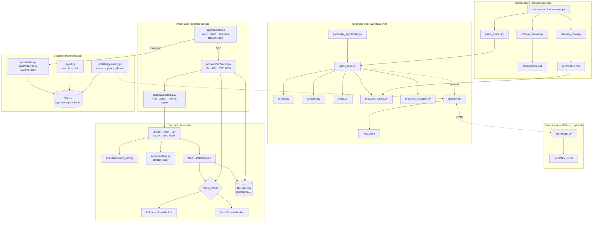

# AoE2 LLM Arena — Technical Documentation

A two-tier AI agent that plays Age of Empires II: Definitive Edition, plus a synthetic evaluation tier (Arena) that races prompt/model variants against an in-memory AoE2-lite world and a web UI for replaying and forking past runs.

---

## Architecture overview

```mermaid
graph TD
    subgraph "Real-game tier (Windows VM)"
        MAIN[gameplay_agent/main.py] --> LOOP[game_loop.py]
        LOOP --> SCREEN[screen.py]
        LOOP --> EXEC[executor.py]
        LOOP --> GOALS[goals.py]
        LOOP --> PROV[providers/claude.py]
        LOOP --> STRAT[providers/strategist.py]
        LOOP -.->|optional| DET[detector.py]
        DET --> YOLO[YOLO26n]
    end

    subgraph "Detection (macOS host, optional)"
        DET <-.->|HTTP| SRV[server/app.py]
        SRV --> COREML[CoreML / ONNX]
    end

    subgraph "Synthetic Arena tier"
        CLI[arena/__main__.py<br/>race / smoke / rank] --> WORLD[evaluation/world_sim.py]
        CLI --> RANK[arena/ranking.py<br/>Bradley-Terry]
        CLI --> SINK[MultiRunBrokerSink]
        SINK --> BROKER{make_broker}
        BROKER --> INPROC[InProcessEventBroker]
        BROKER --> REDIS[RedisStreamsBroker]
        SINK --> DUCK[(DuckDB log<br/>logs/arena/...)]
    end

    subgraph "Arena Web (operator surface)"
        WEB[apps/api/src/server.py<br/>FastAPI + SSE :8000] --> BROKER
        WEB --> DUCK
        WEB --> FORK[apps/api/src/forks.py<br/>POST /forks → async replay]
        FORK --> CLI
        UI[apps/dashboard<br/>Vite + React + TanStack Router/Query] -->|SSE| WEB
    end

    subgraph "Detection training tracker"
        UI -->|/training/*| TAPI[apps/training-api/src/server.py<br/>FastAPI :8100]
        TAPI --> TDB[(SQLite<br/>logs/training/tracker.db)]
        SEED[ingest.py<br/>seed from disk] --> TDB
        PRE[prelabel_pending.py<br/>model → pending boxes] --> TDB
        PRE -.-> DET
    end

    subgraph "Autoresearch (prompt evolution)"
        AR[autoresearch/orchestrator.py] --> MUT[prompt_mutator.py]
        MUT --> SYSP[prompts/core.md]
        AR --> RUN[game_runner.py]
        RUN --> LOOP
        AR --> MEM[memory_chain.py]
        MEM --> MEMDIR[memories/*.md]
        MEMDIR --> PROV
    end

    style DET stroke-dasharray: 5 5
    style SRV stroke-dasharray: 5 5
    style REDIS stroke-dasharray: 5 5
```

Dashed lines indicate optional / off-by-default components. The real-game tier runs without YOLO; the arena tier defaults to the in-process broker; Redis is a Phase C add-on.

---

## Reading paths

Short curated routes through the tutorial — pick one based on what you want to learn, instead of reading all 24 chapters end-to-end.

- **15-minute tour** — [01 System Overview](./part1-architecture/01-system-overview.md) → [07 Detector Architecture](./part3-entity-detection/07-detector-architecture.md) → [14 Arena Overview](./part6-evaluation-arena/14-arena-overview.md).
- **LLM-agent design** — Parts I, II, and VIII: [01](./part1-architecture/01-system-overview.md), [04](./part2-llm-integration/04-provider-pattern.md), [05](./part2-llm-integration/05-prompt-engineering.md), [06](./part2-llm-integration/06-context-injection.md), [22](./part8-autoresearch/22-autoresearch-overview.md), [23](./part8-autoresearch/23-prompt-mutation-and-memory.md).
- **Computer vision** — Parts III–V: [07](./part3-entity-detection/07-detector-architecture.md), [08](./part3-entity-detection/08-training-pipeline.md), [09](./part3-entity-detection/09-labeling-and-active-learning.md), [24](./part3-entity-detection/24-training-tracker.md), [11](./part4-game-knowledge/11-sprite-extraction.md), [13](./part5-operations/13-class-schema-evolution.md).
- **Arena infra** — Parts VI–VII: [14](./part6-evaluation-arena/14-arena-overview.md), [15](./part6-evaluation-arena/15-event-broker.md), [16](./part6-evaluation-arena/16-duckdb-persister-and-replay.md), [17](./part6-evaluation-arena/17-ranking-pipeline.md), [18](./part6-evaluation-arena/18-synthetic-world-sim.md), [19](./part7-arena-web/19-web-architecture.md), [20](./part7-arena-web/20-fork-and-diff-ui.md).

See also the [Glossary](./glossary.md) for one-line definitions of terms used throughout the tutorial.

---

## Table of contents

### Part 1: Real-game architecture

| # | Chapter | Description | Key files |
|---|---|---|---|
| 01 | [System Overview](./part1-architecture/01-system-overview.md) | Two-tier design, graceful degradation, async architecture | `config.py`, `main.py` |
| 02 | [Game Loop Pipeline](./part1-architecture/02-game-loop-pipeline.md) | Capture-detect-alarm-strategist-execute-verify cycle (RTC pipelining, reactive tier) | `game_loop.py`, `reactive.py`, `turn_phases.py`, `goals.py`, `screen.py` |
| 03 | [Action Model & Execution](./part1-architecture/03-action-model-and-execution.md) | Pydantic action types, target_id/target_class resolution | `models.py`, `executor.py` |
| — | [Seven-Round Run Map](./part1-architecture/14-seven-round-run-map.md) | Per-step timing table for the first 7 rounds; async-strategist and loop-delay analysis. Deep dive behind chapter 02. | `game_loop.py` |

### Part 2: LLM integration

| # | Chapter | Description | Key files |
|---|---|---|---|
| 04 | [Provider Pattern](./part2-llm-integration/04-provider-pattern.md) | Abstract base, Claude executor (text-only), strategist (text + local OCR) | `providers/base.py`, `providers/claude.py`, `providers/strategist.py` |
| 05 | [Prompt Engineering](./part2-llm-integration/05-prompt-engineering.md) | Executor + strategist prompt design | `prompts/core.md`, `prompts/strategist.md`, `prompts/ages/*.md` |
| 06 | [Context Injection](./part2-llm-integration/06-context-injection.md) | Memory system, goals, resources, dynamic game knowledge | `memory.py`, `goals.py`, `providers/claude.py` |

### Part 3: Entity detection

| # | Chapter | Description | Key files |
|---|---|---|---|
| 07 | [Detector Architecture](./part3-entity-detection/07-detector-architecture.md) | EntityDetector, PyTorch/ONNX/Mock backends, 60-class taxonomy | `packages/detection/src/inference/detector.py` |
| 08 | [Training Pipeline](./part3-entity-detection/08-training-pipeline.md) | Synthetic data, augmentations, YOLO26n training | `training/generate_training_data.py`, `training/train_yolo.py` |
| 09 | [Labeling & Active Learning](./part3-entity-detection/09-labeling-and-active-learning.md) | CVAT workflow, COCO/YOLO conversion, class definitions | `labeling/prepare_training.py`, `labeling/class_mapping.py` |
| 24 | [Detection Training Tracker](./part3-entity-detection/24-training-tracker.md) | SQLite dataset tracker, prelabel→review loop, coverage stats | `apps/training-api/src/server.py`, `ingest.py`, `prelabel_pending.py` |

### Part 4: Game knowledge

| # | Chapter | Description | Key files |
|---|---|---|---|
| 10 | [Knowledge Database](./part4-game-knowledge/10-knowledge-database.md) | SQLite schema, data sources, dynamic queries | `packages/data/src/game_knowledge.py`, `packages/data/src/fetch_aoe2_data.py` |
| 11 | [Sprite Extraction](./part4-game-knowledge/11-sprite-extraction.md) | SLD format, DXT1 decompression, player color recoloring | `packages/detection/src/extraction/sld_extractor.py` |

### Part 5: Operations

| # | Chapter | Description | Key files |
|---|---|---|---|
| 12 | [Cloud Training](./part5-operations/12-cloud-training.md) | Lambda Labs workflow, dataset packaging, cost analysis | `tmp/train_v2_lambda.sh` |
| 13 | [Class Schema Evolution](./part5-operations/13-class-schema-evolution.md) | Schema history, unified 60-class taxonomy, legacy mapping | `labeling/class_mapping.py`, `training/config/classes.yaml` |

### Part 6: Evaluation arena

| # | Chapter | Description | Key files |
|---|---|---|---|
| 14 | [Arena Overview](./part6-evaluation-arena/14-arena-overview.md) | race / smoke / rank — when to use which | `apps/arena/src/__main__.py`, `apps/arena/src/race.py` |
| 15 | [Event Broker](./part6-evaluation-arena/15-event-broker.md) | Protocol, in-process vs Redis, backpressure, `/metrics` | `packages/evaluation/src/event_broker.py`, `packages/evaluation/src/redis_broker.py`, `packages/evaluation/src/broker_factory.py` |
| 16 | [DuckDB Persister and Replay](./part6-evaluation-arena/16-duckdb-persister-and-replay.md) | Event log schema, cold-path reader, fork primitive | `packages/evaluation/src/event_log.py`, `packages/evaluation/src/duckdb_persister.py`, `packages/evaluation/src/fork.py` |
| 17 | [Ranking Pipeline](./part6-evaluation-arena/17-ranking-pipeline.md) | Bradley-Terry MLE, scenarios, bootstrap CIs | `apps/arena/src/ranking.py`, `apps/arena/src/scenarios.py`, `apps/arena/src/profiles/ranking-v1.yaml` |
| 18 | [Synthetic World Sim](./part6-evaluation-arena/18-synthetic-world-sim.md) | AoE2-lite economy model + perception projection | `packages/evaluation/src/world_sim.py` |

### Part 7: Arena web

| # | Chapter | Description | Key files |
|---|---|---|---|
| 19 | [Web Architecture](./part7-arena-web/19-web-architecture.md) | FastAPI lifespan, `/events` dispatch, reaper, `/forks` flow, SPA route table | `apps/api/src/server.py`, `apps/api/src/forks.py`, `apps/dashboard/src/routes/*` |
| 20 | [Fork and Diff UI](./part7-arena-web/20-fork-and-diff-ui.md) | Timeline scrubber, World/Trace/Diff/Operator tabs | `apps/dashboard/src/routes/_arena.runs.$runId.tsx`, `panels/*` |
| 21 | [Running the UI Locally](./part7-arena-web/21-running-the-ui-locally.md) | Dev proxy, VITE_API_BASE_URL, deployment modes | `apps/dashboard/vite.config.ts` |

### Part 8: Autoresearch

| # | Chapter | Description | Key files |
|---|---|---|---|
| 22 | [Autoresearch Overview](./part8-autoresearch/22-autoresearch-overview.md) | Reflective mutate → run → score → accept/revert loop (Pareto frontier) | `apps/autoresearch/src/orchestrator.py`, `apps/autoresearch/src/pareto.py`, `apps/autoresearch/src/trace.py`, `apps/autoresearch/src/config.yaml` |
| 23 | [Prompt Mutation and Memory](./part8-autoresearch/23-prompt-mutation-and-memory.md) | Mutator constraints, protected sections, memory chain | `apps/autoresearch/src/prompt_mutator.py`, `apps/autoresearch/src/memory_chain.py` |

---

## Architecture Decision Records (ADRs)

Short (~1 page) decisions that shaped the current architecture. Read these to understand the *why*; chapters above describe the *what*.

- [ADR 0001 — Broker-first event architecture](./adr/0001-broker-first-architecture.md)
- [ADR 0002 — Redis Streams as cross-process broker backend](./adr/0002-redis-streams-for-cross-process.md)
- [ADR 0003 — pyright → basedpyright with `reportAny`](./adr/0003-pyright-to-basedpyright.md)
- [ADR 0004 — Bradley-Terry ranking over simple win-rate](./adr/0004-bradley-terry-ranking.md)
- [ADR 0005 — Vite + React + Tailwind for arena UI](./adr/0005-vite-react-tailwind-for-arena-ui.md) *(partially superseded by 0006)*
- [ADR 0006 — TanStack Router + Query and React Aria](./adr/0006-tanstack-router-query-react-aria.md)

---

## Runbooks

"You have a problem right now" checklists. Symptom → diagnosis → command, not narrative.

- [Redis broker operations](./runbooks/redis-broker-ops.md) — compose stack, password rotation, key inspection.
- [Switching the broker backend](./runbooks/switching-broker-backend.md) — in-process ↔ Redis switching, verification.
- [Debugging a stuck fork or replay](./runbooks/debug-stuck-fork.md) — what to check, in what order.
- [Windows VM agent bring-up](./runbooks/windows-vm-agent-bringup.md) — fast path + symptom matrix. Full first-time setup is in [deployment-guide.md](./deployment-guide.md).
- [Retrain the detection model (v6 / YOLO26n)](./runbooks/retrain-detection-v6.md) — end-to-end retraining loop: sprite extraction, real-terrain backgrounds, synthetic generation, cvat.ai annotation, Lambda training, deploy.
- [Record the baseline experiments](./runbooks/baseline-experiments.md) — running 3–5 full games with the current stack into `experiments/results.tsv`.

---

## Run reviews

Post-mortems of individual game runs — what the agent actually did, where it went wrong, and the resulting TODOs.

- [2026-07-11 run 1](./run-reviews/2026-07-11-run1.md) — first post-refactor VM run; full findings and action list.

---

## Reference

- [gameplay.md](./gameplay.md) — deployment topology and the gameplay data flow in brief; the diagram source is [gameplay-flow.mmd](./gameplay-flow.mmd).

---

## Design specs (frozen historical)

Original architectural proposals. Status headers note what shipped. Kept for *why we built it this way* context; current state lives in the chapters above.

- [Event Broker Architecture](./design/event-broker-architecture.md) — log-first SSE design that became Parts 6 chapters 15–16 and ADRs 0001–0002. **Status: SHIPPED.**
- [Synthetic Arena Analysis](./design/synthetic-arena-analysis.md) — fork/race/mutate/observe analysis that became Parts 6–7. **Status: SUPERSEDED BY IMPLEMENTATION.**
- [Autoresearch Plan](./design/autoresearch-plan.md) — 5-phase Karpathy-inspired plan. **Status: PARTIALLY SHIPPED** (Phases 0–1; 2–5 unbuilt).

---

## Explorations

Speculative scratch documents that haven't crystallized into shipped designs.

- [eval-virtualbox-ideas.md](./explorations/eval-virtualbox-ideas.md) — notes on VirtualBox-based headless game replay.

---

## Quick links

- [Game loop entry point](./part1-architecture/02-game-loop-pipeline.md#the-iteration-cycle) — the capture-detect-think-act cycle.
- [Action types reference](./part1-architecture/03-action-model-and-execution.md#31-action-types).
- [System prompt](./part2-llm-integration/05-prompt-engineering.md) — what the executor LLM knows.
- [60-class taxonomy](./part3-entity-detection/07-detector-architecture.md#the-60-class-taxonomy).
- [Arena CLI cheatsheet](./part6-evaluation-arena/14-arena-overview.md#the-three-subcommands).
- [Broker backpressure semantics](./part6-evaluation-arena/15-event-broker.md#backpressure-semantics).

---

## Conventions

- **Code references**: `file.py:42` format points to exact source lines (paths relative to `agent/`).
- **Cross-references**: `[Chapter N](./path)` between related topics.
- **Status callouts**: design docs carry a `Status:` line noting whether they're proposals, shipped, or superseded.
- **Optional modules**: dashed lines in diagrams; explicit notes for graceful-fallback dependencies.
- **ADRs vs chapters**: ADRs answer *"why?"* in 1 page. Chapters answer *"how does it work today?"* in detail. Design specs in `design/` answer *"how did we get here?"* and are frozen in time.
