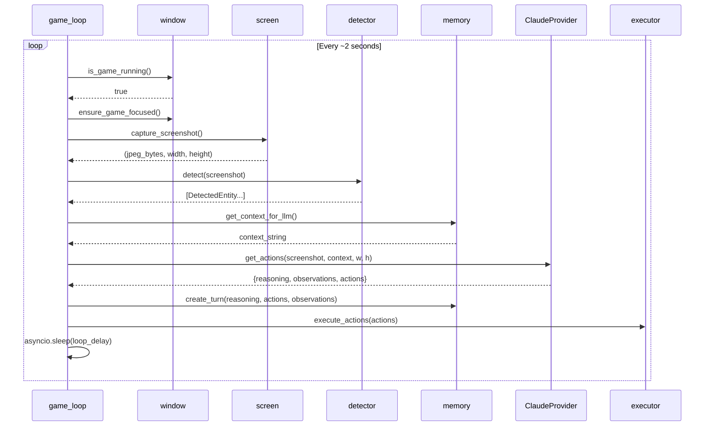

# Chapter 2: Game Loop Pipeline

The game loop is the heartbeat of the agent. Every 2 seconds, it captures a screenshot, optionally detects entities, builds context, asks Claude for actions, updates memory, and executes those actions.

## 2.1 The Iteration Cycle



The full cycle is implemented in `src/game_loop.py:74-162`. Each step:

### Step 1: Check game is running (`game_loop.py:82-84`)

Calls `is_game_running()` which searches for a window titled `"Age of Empires II: Definitive Edition"` via pygetwindow. If the window is gone, the loop exits.

### Step 2: Ensure focus (`game_loop.py:87-90`)

Calls `ensure_game_focused()` with 3 retries and 200ms waits between attempts (`src/window.py:38-77`). If focus fails, the iteration is skipped with `continue` and a 1-second sleep.

### Step 3: Capture screenshot (`game_loop.py:93`)

`capture_screenshot()` (`src/screen.py:12-40`) uses the `mss` library:
1. Gets the game window rectangle via `get_game_window_rect()`
2. Grabs that specific screen region (or full monitor as fallback)
3. Converts from BGRA to RGB via PIL: `Image.frombytes("RGB", size, bgra, "raw", "BGRX")`
4. Encodes as JPEG at quality 85 (configurable)
5. Returns `(bytes, width, height)`

### Step 4: Run entity detection (`game_loop.py:102-110`)

If a detector is initialized (see [Chapter 7](../part3-entity-detection/07-detector-architecture.md)), runs YOLO inference on the screenshot. Results are cached in the executor module via `set_detected_entities()` for later target_id resolution. Detection failures are caught and logged without breaking the loop.

### Step 5: Build context (`game_loop.py:112-124`)

Two context sources are assembled:

1. **Memory context** from `memory.get_context_for_llm()` -- current game state, episode summary, and last 3 turns with action summaries.

2. **Entity context** -- top 15 detected entities formatted as:
   ```
   ## Detected Entities
     sheep_0: sheep at (640,380) [92%]
     villager_0: villager at (520,310) [88%]
     town_center_0: town_center at (960,540) [97%]
   ```

The entity context is prepended to the memory context so the LLM sees detections first.

### Step 6: Get actions from Claude (`game_loop.py:127-137`)

Calls `provider.get_actions(screenshot, context, width, height)` which:
1. Encodes the screenshot as base64 JPEG
2. Adds dimensions info and enhanced context to the user message
3. Calls the Claude API with the system prompt and vision input
4. Parses the JSON response and validates with Pydantic

Returns a dict with `reasoning`, `observations`, and `actions`. See [Chapter 4](../part2-llm-integration/04-provider-pattern.md) for the full provider pipeline.

### Step 7: Update memory (`game_loop.py:140-144`)

`memory.create_turn()` creates a `Turn` record and updates the `GameState` from the LLM's observations (resources, population, age, flags). The turn is added to the working memory deque. See [Chapter 6](../part2-llm-integration/06-context-injection.md) for memory details.

### Step 8: Execute actions (`game_loop.py:147-154`)

`execute_actions()` iterates through the action list, resolving target_ids to coordinates and translating from screenshot-relative to screen-absolute positions. See [Chapter 3](./03-action-model-and-execution.md) for the execution pipeline.

### Step 9: Wait (`game_loop.py:162`)

`asyncio.sleep(config.loop_delay)` -- default 2.0 seconds. This accounts for Claude's API latency (1-3s) plus a buffer for game state to change between decisions.

## 2.2 Single-Iteration Test Mode

`run_single_iteration()` (`src/game_loop.py:171-254`) runs one cycle without looping:

```bash
python -m src.main --test
```

- Captures a screenshot and saves it to `logs/test_{timestamp}.jpg`
- Runs detection and builds context identically to the main loop
- Gets actions from Claude but does **not** execute them by default (`execute=False`)
- Returns a dict with all intermediate results: screenshot path, reasoning, observations, actions, memory context, detected entities

This is invaluable for debugging the vision pipeline without risking unintended game inputs.

## 2.3 Loop Timing

| Phase | Duration | Source |
|-------|----------|--------|
| Window check + focus | ~200ms worst case | `window.py:38-77` (3 retries, 200ms each) |
| Screenshot capture | ~10-30ms | mss grab + PIL convert + JPEG encode |
| YOLO detection | ~50-100ms | ONNX or PyTorch inference at 640x640 |
| Claude API call | 1-3s | Network latency + model inference |
| Action execution | ~50ms per action | pyautogui clicks/presses + 50ms inter-action delay |
| Loop delay | 2.0s | `config.loop_delay` |

The Claude API call dominates. Total cycle time is roughly 3-5 seconds depending on API latency.

## 2.4 Error Handling

The main loop wraps everything in try/except (`game_loop.py:164-168`):

- `KeyboardInterrupt` -- logs and exits cleanly
- Any other exception -- logs the error with iteration number and re-raises

Individual steps have their own error handling:
- Detection failures are caught and logged (`game_loop.py:108-110`) -- the loop continues without detection
- Focus failures skip the iteration (`game_loop.py:87-90`)
- API errors are caught in the provider and return a wait action (`providers/claude.py:244-250`)

> **Key Insight**: Camera-moving hotkeys (H and period) invalidate all screen coordinates because the viewport shifts. The system prompt teaches the LLM to end its turn immediately after pressing these keys, ensuring the next iteration captures a fresh screenshot with valid coordinates. This is a non-obvious constraint that prevents the agent from clicking on stale positions after camera pans.

---

## Summary

- 9-step iteration cycle: check game, focus, capture, detect, build context, call LLM, update memory, execute, wait
- ~3-5 second cycle time dominated by Claude API latency
- Test mode for debugging without executing actions
- Graceful error handling at each step -- no single failure crashes the loop

## Related Topics

- [Chapter 1: System Overview](./01-system-overview.md) -- component dependencies and graceful degradation
- [Chapter 3: Action Model & Execution](./03-action-model-and-execution.md) -- how actions are validated and executed
- [Chapter 6: Context Injection](../part2-llm-integration/06-context-injection.md) -- what context the LLM receives
