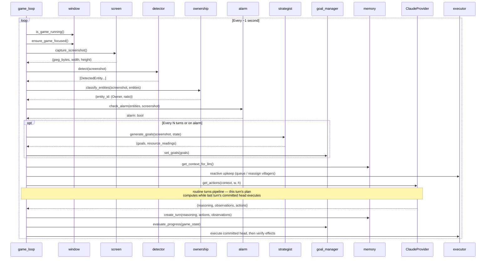

# Chapter 2: Game Loop Pipeline

The game loop is the heartbeat of the agent. Every ~1 second, it captures a screenshot, detects entities, checks for threats, optionally runs the strategist, builds text context, asks the executor for actions, and executes them.

<aside class="prereqs">

Python asyncio and [Chapter 1](./01-system-overview.md). Computer-vision basics help — YOLO detection and Kalman tracking each get their own deep dives ([Appendix A — YOLO and object detection](../appendix/01-yolo-and-object-detection.md) and the Kalman/Hungarian sidebar at the end of §2.1).

</aside>

## 2.1 The Iteration Cycle


```mermaid
sequenceDiagram
    participant GL as game_loop
    participant W as window
    participant S as screen
    participant D as detector
    participant OWN as ownership
    participant ALM as alarm
    participant STR as strategist
    participant GM as goal_manager
    participant M as memory
    participant C as ClaudeProvider
    participant E as executor

    loop Every ~1 second
        GL->>W: is_game_running()
        GL->>W: ensure_game_focused()
        GL->>S: capture_screenshot()
        S-->>GL: (jpeg_bytes, width, height)
        GL->>D: detect(screenshot)
        D-->>GL: [DetectedEntity...]
        GL->>OWN: classify_entities(screenshot, entities)
        OWN-->>GL: {entity_id: (Owner, ratio)}
        GL->>ALM: check_alarm(entities, screenshot)
        ALM-->>GL: alarm: bool
        opt Every N turns or on alarm
            GL->>STR: generate_goals(screenshot, state)
            STR-->>GL: (goals, resource_readings)
            GL->>GM: set_goals(goals)
        end
        GL->>M: get_context_for_llm()
        GL->>E: reactive upkeep (queue / reassign villagers)
        GL->>C: get_actions(context, w, h)
        Note over GL,C: routine turns pipeline — this turn's plan<br/>computes while last turn's committed head executes
        C-->>GL: {reasoning, observations, actions}
        GL->>M: create_turn(reasoning, actions, observations)
        GL->>GM: evaluate_progress(game_state)
        GL->>E: execute committed head, then verify effects
    end
```

The main loop is implemented in `game_loop()` with phase logic decomposed into named functions.

### Step 1: Check game is running

Calls `is_game_running()` which searches for a window titled `"Age of Empires II: Definitive Edition"` via pygetwindow. If the window is gone, the loop exits.

### Step 2: Ensure focus

Calls `ensure_game_focused()`. If focus fails, the iteration is skipped with `continue` and a 1-second sleep.

### Step 3: Capture screenshot — `_capture_screenshot()`

Uses the `mss` library to grab the game window region, convert from BGRA to RGB via PIL, and encode as JPEG. Returns `(bytes, width, height)`. Optionally saves screenshots to disk when `config.save_screenshots` is enabled.

### Step 4: Run entity detection — `_run_detection()`

Entity detection runs a **single forward pass at `imgsz=1280`** — the resolution the v9 model was trained at (`config.detection_imgsz = 1280`, `config.adaptive_sahi = False`). On real screenshots, matching inference resolution to training resolution beats SAHI-tiled inference: tiling a 3024px frame into 640 crops makes objects ~2.4× larger than v9's training scale and *lowers* real F1. SAHI is implemented but off; see [Chapter 7 §7.4](../part3-entity-detection/07-detector-architecture.md) for the measurement and the v6/v7-era mode comparison.

> When `config.adaptive_sahi` is `True` (it isn't, by default), the loop instead runs adaptive SAHI and forces full SAHI on the first iteration, every `full_sahi_interval` turns, and after an alarm — the parked path for a future SAHI-native model.

Results are cached in the executor module via `set_detected_entities()` for later target_id/target_class resolution. Entity IDs persist across frames via the Kalman filter tracker. Detection failures are caught and logged without breaking the loop.

### Step 5: Classify ownership — `_classify_entities()`

For military entities, a color-based classifier checks blue pixel dominance in the health bar and unit body regions. In AoE2:DE, Player 1 is always blue. Entities are tagged `[own]` or `[enemy]` in the text context sent to the executor.

Entity formatting uses `build_entity_summary()` from `entity_utils.py`, which normalizes both `DetectedEntity` objects and plain dicts via `extract_attrs()`.

### Step 6: Alarm check

Scans detected entities for 21 enemy military classes (militia_line, archer_line, knight_line, etc.). Uses ownership classification to filter out own units. If enemy threats are found, injects a priority-10 "Defend base" goal and triggers an early strategist run.

### Step 7: Launch strategist — `_maybe_launch_strategist()`

The strategist (Sonnet) runs every N turns (default 10), on the first successful iteration, or when an alarm is triggered. It is launched **asynchronously** via `asyncio.create_task()` so it runs in the background while the executor continues. If a previous strategist task is still pending, it is reused rather than launching a new one.

The strategist:
1. Reads resource values, population, and age from the resource bar **locally via OCR** (`resource_ocr.read_resource_bar`, RapidOCR) — the screenshot is passed in for this, but **no image is sent to Claude**. Field geometry is auto-detected per frame (`autodetect_calibration`), with an optional `calibration.<W>x<H>.yaml` override.
2. Sends those readings to Sonnet in a **text-only** prompt
3. Creates 3-5 prioritized goals
4. Returns resource readings that are cached for the executor

The strategist uses `messages.parse()` with a `StrategistResponse` Pydantic model for structured output. In the cleanup phase, any pending strategist task is awaited to ensure goals are finalized.

### Step 8: Build context — `_build_llm_context()`

Assembles text context from multiple sources, layered in this order:
1. **Detected entities** — YOLO results formatted as text: `sheep_0: sheep at (456,789) [95%]`
2. **Active goals** — from goal manager, sorted by priority: `[HIGH] Queue villagers: 4/10 (40%)`
3. **Resource readings** — cached from strategist: `Food: 250, Wood: 180, Gold: 50, Stone: 100`
4. **Game state** — from memory: population, age, under_attack flags
5. **Recent decisions** — last 3 turns with action feedback
6. **Dynamic game knowledge** — affordable units/buildings based on current resources (optional)

### Step 9: Get actions from executor (pipelined)

Routine turns are **pipelined** RTC-style (request-to-completion overlap): the executor call for *this* turn is launched as a background task via `asyncio.create_task(provider.get_actions(...))`, and while it computes the agent does useful work in that window:

1. **Ground commands** (turn 1 only) — zoom in, select scout, enable auto-scout
2. **Reactive tier** (`reactive.decide`) — deterministic, no-LLM upkeep run every turn: queue a villager when population is below the age cap, and send an idle villager to the nearest resource. It returns nothing on alarm, ceding combat to the LLM.
3. **Previous turn's committed head** — the plan launched last turn is drained and executed now (Step 11), against freshly re-detected entities.

The freshly-launched plan is held as a `_PendingPlan` and executed on the *next* iteration. Whether a turn pipelines is decided by `_should_pipeline` (= `provider._use_single_shot(context)`): combat/housing turns can't pipeline because the tool loop executes its own actions mid-call, so they run **synchronously** — any pending routine plan is discarded (its frame is stale) and the turn's actions execute the same turn.

The executor is 100% text-based — no screenshot. `get_actions()` picks one of two paths per turn (`_use_single_shot`): routine turns take a **single-shot** structured call (`_call_single_shot` — one roundtrip; the returned actions are executed by the game loop), while combat/housing turns take an **agentic tool loop** (`_call_api`) where Claude calls tools one at a time (up to `max_tool_iterations = 7`), each executed locally via `execute_action()` with the result fed back. Composite tools (`build`, `send_villager`, `queue_villager`) execute multi-step sequences within a single tool call, eliminating intermediate API roundtrips.

### Step 10: Update memory and goals — `_process_response()`

Creates a `Turn` record, updates `GameState` from the executor's observations. Evaluates goal progress against the updated state. Computes a turn reward based on resource deltas, population changes, and age progression. Checks for game-over conditions (victory, defeat, timeout).

### Step 11: Execute actions — `_execute_turn_actions()`

If the agentic tool loop already executed actions (indicated by `actions_already_executed` flag), this step just records the results. Otherwise, it executes LLM actions:
- For a **pipelined** turn, only the **committed head** runs — the first `pipeline_commit_max` (2) actions, after `_revalidate_against_fresh` drops any whose `target_id`/`target_class` no longer resolves against the current frame. The tail is discarded: next turn's plan supersedes it from fresher perception.
- Resolves `target_id` or `target_class` to coordinates from cached entity positions
- Translates coordinates from screenshot-relative to screen-absolute
- Executes via pyautogui with `action_delay` (50ms) between actions
- Tracks success/failure via `ActionResult` — failed actions are recorded in memory as feedback for the next turn
- **Verifies effects (R1).** After entity-affecting actions (a `build`/placement, or a camera move), it re-detects and records a verification line — `CONFIRMED built: <class>` on success, or the exact phrase `no visible change` on a miss. That line feeds the stuck-loop detector in `memory.get_context_for_llm`, so repeated no-ops escalate to a warning the LLM sees. Routine economy turns with no entity expectation skip the extra rescan.
- If no actions were returned, logs `no_actions_fallback` and runs a **housed-aware** fallback: when population ≥ population cap (housed), it builds a house (via the coordinate-free `build` action) to unblock villager production; otherwise it nudges the economy — go to TC, queue a villager, select an idle one. This keeps a stalled turn from freezing the economy at the population cap.
- On `rescan: true`, runs the rescan pipeline:
  1. **Tracker prediction check** — if tracker confidence > 80%, extrapolate positions via Kalman predict (~0ms, no screenshot or inference needed)
  2. **Screenshot capture** — if prediction not used
  3. **Frame differencing** — compare to previous frame; skip detection if MAD < 3%
  4. **Fast detection** — single-pass `detect_fast()` at `imgsz=1280` (the same mode as the main detection step)

### Step 12: Wait

`asyncio.sleep(config.loop_delay)` — default 0.3 seconds.

<aside class="concept" data-title="Frame differencing and the MAD threshold (why we skip detection sometimes)">

The rescan branch in Step 11 skips detection entirely when the frame hasn't changed enough to matter. "Enough" is measured with **Mean Absolute Difference (MAD)**: compute the per-pixel absolute difference between the current and previous frame, average across all pixels, divide by 255 to get a 0–1 score. If MAD < 3% (the chapter's threshold), we treat the frame as visually identical and reuse the previous detection.

Two tuning notes a reader might not anticipate:

- **The top 4% of the frame is excluded from the MAD computation.** That strip is the resource bar — its numbers tick constantly even when nothing else changes, and including it would push MAD over the threshold on frames that are otherwise static. The clip is a single `frame[int(h*0.04):]` slice.
- **The threshold (3%) is a noise/signal trade-off.** Lower (1%) and you'll trigger detection on JPEG-compression noise alone — wasted work. Higher (10%) and you'll skip detection during real action — stale entities. 3% was found by sweeping the threshold against a labeled set of "did this frame need re-detection?" decisions.

MAD is the cheapest possible change-detection metric — one subtraction and one mean per frame, ~0.5 ms on a 1080p image. SSIM (structural similarity) is more semantically meaningful but ~10× slower, and overkill for our binary "did anything change?" question.

</aside>

<details class="deep-dive">
<summary>Deep dive — Adaptive SAHI and ROI clustering (built, measured, parked)</summary>

> **This describes a path we built and then disabled.** The agent ships **single-pass @1280** (v9's training resolution), not SAHI. The mode comparison that ruled SAHI out was run on the v6/v7 model (trained @640): single-pass @640 ≈ 0.42 real F1, @1280 ≈ 0.21 (run *above* its training scale), full SAHI ≈ 0.04. The lesson is scale-matching, not a fixed number — run a model off its training resolution and accuracy drops. v9 is trained at 1280, so the agent infers at 1280; SAHI stays off because tiling a 3024px frame into 640 crops *still* shows objects ~2.4× larger than v9's 1280 training scale. The adaptive-SAHI machinery below stays in the codebase for a future model retrained at SAHI-native scale — it's kept here as the design we'd reach for *then*, not what runs now.

**The base problem (as it looked pre-v6).** A game screenshot resized to YOLO's 640×640 throws away resolution that small entities (sheep, scouts) depend on — *if the model was trained on larger crops*. The fix turned out to be simpler than tiling: train and infer at the same resolution, so the resize is exactly what the model expects. v6 did this at 640; v9 raised both training and inference to 1280, giving small entities more pixels without tiling.

**SAHI — the classic fix.** *Slicing Aided Hyper Inference* (Akyon et al., 2022) slices the input into overlapping tiles, runs the detector on each tile at full resolution, then merges the per-tile predictions back into image coordinates (with extra NMS on overlap zones). For a 1920×1080 screen with 640×640 tiles and 20% overlap, that's ~18 tiles per frame. It raises recall on small objects *when the tile scale matches training* — which, for our model at retina resolution, it doesn't.

**Adaptive SAHI — the parked two-pass scheme.** Pays the tiling cost only where it matters:

1. **Fast scan.** Run YOLO once at `imgsz=1280` (a single full-frame pass, far cheaper than the tiled approach). Catches every medium-and-large object plus a noisy first guess at where the small stuff is. ~60 ms.
2. **ROI clustering.** Take the bounding boxes of the small/uncertain detections, cluster them into a handful of regions of interest using a **Union-Find** (disjoint-set) data structure. Two boxes belong to the same ROI if their inflated bounding boxes intersect; Union-Find walks the box list once and assigns each to its cluster root in near-constant amortized time.
3. **Targeted SAHI.** Run YOLO at full resolution only on those 3–8 ROI tiles. ~40–140 ms depending on ROI count.
4. **Merge + NMS.** Combine fast-scan predictions outside the ROIs with the targeted-SAHI predictions inside them, then a final NMS pass.

**Why Union-Find for clustering?** We need: *given N boxes, group any pair that overlap into the same cluster*. The naive O(N²) pairwise intersection works at N ≤ 50 but degrades. K-means doesn't fit — clusters aren't centroidal, they're connectivity components. DBSCAN works but is more code. **Union-Find runs in O(N · α(N))** — practically O(N) — and the implementation is ~30 lines: each box starts in its own set, and any time two boxes overlap you `union()` their sets. The chapter's full SAHI fallback is what you'd use if you wanted exhaustive coverage of every tile regardless of content.

**When adaptive SAHI is wrong to use.** First frame (no prior boxes → no ROIs → only the fast scan runs → you miss things). Solution: force full SAHI on the first frame, and on every Nth frame (`full_sahi_interval=5`), and after an alarm. These are the three branches you see in Step 4.

**Further reading.** Akyon et al., *Slicing Aided Hyper Inference and Fine-tuning for Small Object Detection* (2022). Sedgewick & Wayne, *Algorithms* (4th ed.), §1.5 for the Union-Find treatment.

</details>

<details class="deep-dive">
<summary>Deep dive — Kalman filters and the Hungarian algorithm (how IDs persist across frames)</summary>

**Why we need this:** the detector gives you a fresh list of boxes every frame, but those boxes don't carry identity — frame N's `sheep` at (455, 790) and frame N+1's `sheep` at (462, 794) have to be linked back to *the same sheep* so the LLM can refer to `sheep_0` across turns. That's the multi-object tracking problem, and the canonical solution is a two-step loop: **predict where each tracked entity is now → match predictions to detections → update tracks with the matched detections**.

**The Kalman filter — mental model.** Picture each tracked entity carrying a small Gaussian "cloud" describing where the system thinks it is. The cloud has a mean (best guess: `[x, y, vx, vy]` for a constant-velocity model) and a covariance (how uncertain that guess is). On every frame we do two things:

1. **Predict.** Push the mean forward by `Δt` using the velocity (`x' = x + vx·Δt`) and *grow* the covariance — uncertainty always increases when you don't see new evidence. This is the closed-form update `μ' = F·μ`, `Σ' = F·Σ·Fᵀ + Q`, where `F` is the state-transition matrix and `Q` is the process noise (how much we expect the entity to deviate from constant velocity per step).
2. **Update.** When a detection arrives, the filter computes a weighted average between the prediction and the observation, weighted by their relative uncertainties (the Kalman gain `K`). A confident prediction + noisy observation → trust the prediction. Stale prediction + crisp observation → trust the observation.

**Hungarian assignment — the matching step.** Before we can call "update," we have to know *which* detection goes with *which* track. Build an `N × M` cost matrix (N tracked entities × M detections this frame) where each cell is some distance — pixel distance, `1 - IoU`, or a Mahalanobis distance using the track's covariance. The Hungarian algorithm finds the assignment that minimizes total cost in **O((N+M)³)** — globally optimal, not greedy. Unmatched detections become new tracks; unmatched tracks decay (and after a few frames of misses, get retired).

**Why we picked it.** Kalman is *lightweight* (a few small matrix ops per track, no training, no GPU), *probabilistic* (the covariance is a built-in confidence score — the rescan path uses `confidence > 80%` to skip a screenshot entirely), and *well-behaved under partial occlusion* (the prediction carries the entity forward through a few missed frames). Hungarian is *exact and fast* at the scale of dozens of entities.

**When it breaks.** Rapid acceleration (a knight charging) violates the constant-velocity model — the prediction lags and matching can swap IDs. Heavy occlusion (a building behind a tree) eventually exhausts the "no-update tolerance" and the track is retired, then re-spawns with a new ID. For our use case (top-down isometric, slow units, mostly-visible entities) this is rarely a problem; for highway traffic or sports you'd reach for a learned tracker like ByteTrack or BoT-SORT.

**Further reading.** Welch & Bishop, *An Introduction to the Kalman Filter* (2006) — the classic 20-page write-up. SORT (Bewley et al., 2016) is the original "Kalman + Hungarian" multi-object tracker and is the algorithmic ancestor of our tracker.

</details>

## 2.2 Single-Iteration Test Mode

`run_single_iteration()` runs one cycle without looping:

```bash
python -m gameplay_agent --test
```

Captures a screenshot, runs detection, builds context, gets actions from Claude but does **not** execute them by default. Returns all intermediate results for debugging.

## 2.3 Loop Timing

| Phase | Duration | Source |
|-------|----------|--------|
| Window check + focus | ~200ms worst case | `window.py` (3 retries, 200ms each) |
| Screenshot capture | ~10-30ms | mss grab + PIL convert + JPEG encode |
| YOLO detection (single-pass @1280) | one forward pass | The deployed path (`adaptive_sahi=False`); cost is backend/hardware-dependent |
| Ownership classification | ~5ms | NumPy pixel analysis |
| Strategist call (periodic) | 3-8s | Sonnet text call (resources via local OCR) |
| Executor single-shot (routine turns) | ~2-4s | One `messages.parse` call, no tool loop |
| Executor call (per tool iteration) | ~3s | Roundtrips in the agentic loop (combat/housing) |
| Action execution | ~50ms per action | pyautogui + 50ms inter-action delay |
| Rescan: tracker prediction | ~0ms | Kalman extrapolation (confidence > 80%) |
| Rescan: fast detection | one forward pass | Single-pass YOLO at imgsz=1280 |
| Loop delay | 0.3s | `config.loop_delay` |

Cycle time depends on the path: **routine turns single-shot in ~one roundtrip** (~2-4s of API + 0.3s loop delay), and because routine turns pipeline, the previous turn's committed head plus the reactive tier execute *during* that roundtrip rather than adding to it. Combat/housing turns run the agentic tool loop synchronously and can reach ~20-30s when they use all 7 iterations. Composite tools cut the loop path further (~9s saved per building placement). The strategist runs in the background and does not add to cycle time.

## 2.4 Error Handling

The main loop wraps everything in try/except:

- `KeyboardInterrupt` — logs and exits cleanly
- Any other exception — logs the error with iteration number and re-raises

Individual steps have their own error handling:
- Detection failures are caught and logged — the loop continues without detection
- Focus failures skip the iteration
- Strategist failures are caught — executor continues with stale goals/readings
- API errors in the executor return a wait action

## 2.5 Time Budget

The game loop supports a `time_budget` parameter (seconds). When elapsed time exceeds the budget, the loop exits with `game_end_reason = "timeout"`. Used by the autoresearch framework for timed experiments.

---

## Summary

- 12-step iteration cycle: check → focus → capture → detect → classify → alarm → strategist → context → executor → memory → execute+verify → wait
- Cycle time depends on the path: routine turns single-shot in ~2-4s; combat/housing turns run the agentic tool loop and can reach ~30s
- Routine turns are pipelined (RTC): the executor call overlaps the previous turn's committed head plus the deterministic reactive tier (villager queue/reassign) via `asyncio.create_task()`; combat turns run synchronously
- Action-effect verification (R1): entity-affecting actions are confirmed by re-detection, and misses emit `no visible change` into the stuck-loop detector
- Strategist runs asynchronously in the background; executor runs every turn
- Composite tools (build, send_villager, queue_villager) eliminate multiple API roundtrips per sequence
- Detection is a single pass at `imgsz=1280` (v9's training resolution); SAHI is implemented but disabled because it lowers real F1 at retina resolution
- Rescans use tracker prediction (~0ms) or single-pass fast detection
- Goal-driven with reward computation per turn
- Action failure feedback tracked via `ActionResult` and fed back to memory

## Related Topics

- [Chapter 1: System Overview](./01-system-overview.md) — component dependencies and graceful degradation
- [Chapter 3: Action Model & Execution](./03-action-model-and-execution.md) — how actions are validated and executed
- [Chapter 6: Context Injection](../part2-llm-integration/06-context-injection.md) — what context the LLM receives
