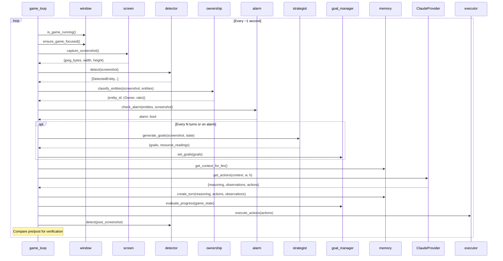

# Chapter 2: Game Loop Pipeline

The game loop is the heartbeat of the agent. Every ~1 second, it captures a screenshot, detects entities, checks for threats, optionally runs the strategist, builds text context, asks the executor for actions, executes them, and verifies the results.

## 2.1 The Iteration Cycle


```mermaid
sequenceDiagram
    participant GL as game_loop
    participant W as window
    participant S as screen
    participant D as detector
    participant OWN as ownership
    participant ALM as alarm
    participant STR as strategist
    participant GM as goal_manager
    participant M as memory
    participant C as ClaudeProvider
    participant E as executor

    loop Every ~1 second
        GL->>W: is_game_running()
        GL->>W: ensure_game_focused()
        GL->>S: capture_screenshot()
        S-->>GL: (jpeg_bytes, width, height)
        GL->>D: detect(screenshot)
        D-->>GL: [DetectedEntity...]
        GL->>OWN: classify_entities(screenshot, entities)
        OWN-->>GL: {entity_id: (Owner, ratio)}
        GL->>ALM: check_alarm(entities, screenshot)
        ALM-->>GL: alarm: bool
        opt Every N turns or on alarm
            GL->>STR: generate_goals(screenshot, state)
            STR-->>GL: (goals, resource_readings)
            GL->>GM: set_goals(goals)
        end
        GL->>M: get_context_for_llm()
        GL->>C: get_actions(context, w, h)
        C-->>GL: {reasoning, observations, actions}
        GL->>M: create_turn(reasoning, actions, observations)
        GL->>GM: evaluate_progress(game_state)
        GL->>E: execute_actions(actions)
        GL->>D: detect(post_screenshot)
        Note over GL: Compare pre/post for verification
    end
```

The full cycle is implemented in `src/game_loop.py:98-378`.

### Step 1: Check game is running (`game_loop.py:172-175`)

Calls `is_game_running()` which searches for a window titled `"Age of Empires II: Definitive Edition"` via pygetwindow. If the window is gone, the loop exits.

### Step 2: Ensure focus (`game_loop.py:177-181`)

Calls `ensure_game_focused()`. If focus fails, the iteration is skipped with `continue` and a 1-second sleep.

### Step 3: Capture screenshot (`game_loop.py:183-190`)

`capture_screenshot()` uses the `mss` library to grab the game window region, convert from BGRA to RGB via PIL, and encode as JPEG. Returns `(bytes, width, height)`.

### Step 4: Run entity detection (`game_loop.py:192-201`)

YOLO v5 model detects entities. Results are cached in the executor module via `set_detected_entities()` for later target_id/target_class resolution. Detection failures are caught and logged without breaking the loop.

### Step 5: Classify ownership (`game_loop.py:204-213`)

For military entities, a color-based classifier checks blue pixel dominance in the health bar and unit body regions. In AoE2:DE, Player 1 is always blue. Entities are tagged `[own]` or `[enemy]` in the text context sent to the executor.

### Step 6: Alarm check (`game_loop.py:228-230`)

Scans detected entities for 21 enemy military classes (militia_line, archer_line, knight_line, etc.). Uses ownership classification to filter out own units. If enemy threats are found, injects a priority-10 "Defend base" goal and triggers an early strategist run.

### Step 7: Run strategist (`game_loop.py:232-253`)

The strategist (Sonnet) runs every N turns (default 10), on the first successful iteration, or when an alarm is triggered. It:
1. Receives the screenshot as a base64 image
2. Reads resource values, population, and age from the game UI
3. Creates 3-5 prioritized goals
4. Returns resource readings that are cached for the executor

The strategist uses `messages.parse()` with a `StrategistResponse` Pydantic model for structured output.

### Step 8: Build context (`game_loop.py:255-273`)

Assembles text context from multiple sources, layered in this order:
1. **Detected entities** — YOLO results formatted as text: `sheep_0: sheep at (456,789) [95%]`
2. **Active goals** — from goal manager, sorted by priority: `[HIGH] Queue villagers: 4/10 (40%)`
3. **Resource readings** — cached from strategist: `Food: 250, Wood: 180, Gold: 50, Stone: 100`
4. **Game state** — from memory: population, age, under_attack flags
5. **Recent decisions** — last 3 turns with verification results
6. **Dynamic game knowledge** — affordable units/buildings based on current resources (optional)

### Step 9: Get actions from executor (`game_loop.py:275-286`)

Calls `provider.get_actions(context, width, height)` — note: **no screenshot**. The executor is 100% text-based. It uses `messages.parse()` with the `LLMResponse` Pydantic model.

The `LLMResponse` fields are ordered: `actions` first, then `observations`, then `reasoning`. This ensures structured output generates actions before reasoning consumes the token budget.

### Step 10: Update memory and goals (`game_loop.py:288-313`)

Creates a `Turn` record, updates `GameState` from the executor's observations. Evaluates goal progress against the updated state. Computes a turn reward based on resource deltas, population changes, and age progression.

### Step 11: Execute actions (`game_loop.py:328-337`)

`execute_actions()` iterates through the action list:
- Resolves `target_id` to coordinates from cached entity positions
- Resolves `target_class` to the nearest entity of that class
- Translates coordinates from screenshot-relative to screen-absolute
- Executes via pyautogui with `action_delay` (50ms) between actions
- On `rescan: true`, takes a mid-turn screenshot and re-detects entities

### Step 12: Action verification (`game_loop.py:339-350`)

After execution, captures a new screenshot and runs detection. Compares pre/post entity states:
- New entities (e.g., building placed)
- Disappeared entities (e.g., resource gathered)
- Moved entities (e.g., unit repositioned)
- No change (action may have failed)

Verification results are stored in memory and sent to the executor as context on the next turn.

### Step 13: Wait (`game_loop.py:358`)

`asyncio.sleep(config.loop_delay)` — default 1.0 seconds.

## 2.2 Single-Iteration Test Mode

`run_single_iteration()` runs one cycle without looping:

```bash
python -m src.main --test
```

Captures a screenshot, runs detection, builds context, gets actions from Claude but does **not** execute them by default. Returns all intermediate results for debugging.

## 2.3 Loop Timing

| Phase | Duration | Source |
|-------|----------|--------|
| Window check + focus | ~200ms worst case | `window.py` (3 retries, 200ms each) |
| Screenshot capture | ~10-30ms | mss grab + PIL convert + JPEG encode |
| YOLO detection | ~234ms | PyTorch inference at imgsz=1280 |
| Ownership classification | ~5ms | NumPy pixel analysis |
| Strategist call (periodic) | 3-8s | Sonnet vision API call |
| Executor call | 1-3s | Haiku text API call |
| Action execution | ~50ms per action | pyautogui + 50ms inter-action delay |
| Verification detection | ~234ms | Post-action YOLO inference |
| Loop delay | 1.0s | `config.loop_delay` |

On non-strategist turns, total cycle time is ~3-5 seconds. On strategist turns, add 3-8 seconds for the Sonnet call.

## 2.4 Error Handling

The main loop wraps everything in try/except:

- `KeyboardInterrupt` — logs and exits cleanly
- Any other exception — logs the error with iteration number and re-raises

Individual steps have their own error handling:
- Detection failures are caught and logged — the loop continues without detection
- Focus failures skip the iteration
- Strategist failures are caught — executor continues with stale goals/readings
- API errors in the executor return a wait action

## 2.5 Time Budget

The game loop supports a `time_budget` parameter (seconds). When elapsed time exceeds the budget, the loop exits with `game_end_reason = "timeout"`. Used by the autoresearch framework for timed experiments.

---

## Summary

- 13-step iteration cycle: check → focus → capture → detect → classify → alarm → strategist → context → executor → memory → execute → verify → wait
- ~3-5 second cycle time dominated by Claude API latency
- Strategist runs periodically; executor runs every turn
- Goal-driven with reward computation per turn
- Action verification provides closed-loop feedback

## Related Topics

- [Chapter 1: System Overview](./01-system-overview.md) — component dependencies and graceful degradation
- [Chapter 3: Action Model & Execution](./03-action-model-and-execution.md) — how actions are validated and executed
- [Chapter 6: Context Injection](../part2-llm-integration/06-context-injection.md) — what context the LLM receives
