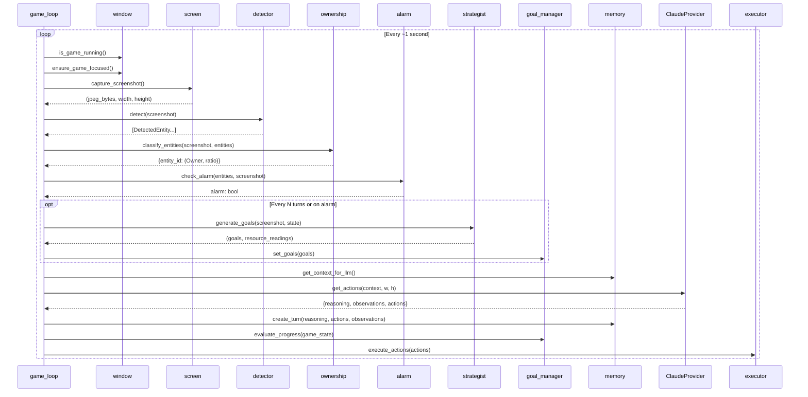

# Chapter 2: Game Loop Pipeline

The game loop is the heartbeat of the agent. Every ~1 second, it captures a screenshot, detects entities, checks for threats, optionally runs the strategist, builds text context, asks the executor for actions, and executes them.

## 2.1 The Iteration Cycle


```mermaid
sequenceDiagram
    participant GL as game_loop
    participant W as window
    participant S as screen
    participant D as detector
    participant OWN as ownership
    participant ALM as alarm
    participant STR as strategist
    participant GM as goal_manager
    participant M as memory
    participant C as ClaudeProvider
    participant E as executor

    loop Every ~1 second
        GL->>W: is_game_running()
        GL->>W: ensure_game_focused()
        GL->>S: capture_screenshot()
        S-->>GL: (jpeg_bytes, width, height)
        GL->>D: detect(screenshot)
        D-->>GL: [DetectedEntity...]
        GL->>OWN: classify_entities(screenshot, entities)
        OWN-->>GL: {entity_id: (Owner, ratio)}
        GL->>ALM: check_alarm(entities, screenshot)
        ALM-->>GL: alarm: bool
        opt Every N turns or on alarm
            GL->>STR: generate_goals(screenshot, state)
            STR-->>GL: (goals, resource_readings)
            GL->>GM: set_goals(goals)
        end
        GL->>M: get_context_for_llm()
        GL->>C: get_actions(context, w, h)
        C-->>GL: {reasoning, observations, actions}
        GL->>M: create_turn(reasoning, actions, observations)
        GL->>GM: evaluate_progress(game_state)
        GL->>E: execute_actions(actions)
    end
```

The main loop is implemented in `game_loop()` with phase logic decomposed into named functions.

### Step 1: Check game is running

Calls `is_game_running()` which searches for a window titled `"Age of Empires II: Definitive Edition"` via pygetwindow. If the window is gone, the loop exits.

### Step 2: Ensure focus

Calls `ensure_game_focused()`. If focus fails, the iteration is skipped with `continue` and a 1-second sleep.

### Step 3: Capture screenshot — `_capture_screenshot()`

Uses the `mss` library to grab the game window region, convert from BGRA to RGB via PIL, and encode as JPEG. Returns `(bytes, width, height)`. Optionally saves screenshots to disk when `config.save_screenshots` is enabled.

### Step 4: Run entity detection — `_run_detection()`

Entity detection uses **adaptive SAHI** by default (`config.adaptive_sahi = True`). Adaptive SAHI runs a fast single-pass scan at `imgsz=1280`, clusters detected entities into ROI regions, then runs SAHI tiling only on those regions (~3-8 tiles instead of ~18 for full SAHI). This reduces detection latency from ~234ms to ~100-200ms.

Full SAHI is forced on:
- The first iteration (no prior entity data)
- Every `full_sahi_interval` turns (default 5) to catch entities in new areas
- When an alarm was triggered on the previous turn

Results are cached in the executor module via `set_detected_entities()` for later target_id/target_class resolution. Entity IDs persist across frames via the Kalman filter tracker. Detection failures are caught and logged without breaking the loop.

### Step 5: Classify ownership — `_classify_entities()`

For military entities, a color-based classifier checks blue pixel dominance in the health bar and unit body regions. In AoE2:DE, Player 1 is always blue. Entities are tagged `[own]` or `[enemy]` in the text context sent to the executor.

Entity formatting uses `build_entity_summary()` from `entity_utils.py`, which normalizes both `DetectedEntity` objects and plain dicts via `extract_attrs()`.

### Step 6: Alarm check

Scans detected entities for 21 enemy military classes (militia_line, archer_line, knight_line, etc.). Uses ownership classification to filter out own units. If enemy threats are found, injects a priority-10 "Defend base" goal and triggers an early strategist run.

### Step 7: Launch strategist — `_maybe_launch_strategist()`

The strategist (Sonnet) runs every N turns (default 10), on the first successful iteration, or when an alarm is triggered. It is launched **asynchronously** via `asyncio.create_task()` so it runs in the background while the executor continues. If a previous strategist task is still pending, it is reused rather than launching a new one.

The strategist:
1. Receives the screenshot as a base64 image
2. Reads resource values, population, and age from the game UI
3. Creates 3-5 prioritized goals
4. Returns resource readings that are cached for the executor

The strategist uses `messages.parse()` with a `StrategistResponse` Pydantic model for structured output. In the cleanup phase, any pending strategist task is awaited to ensure goals are finalized.

### Step 8: Build context — `_build_llm_context()`

Assembles text context from multiple sources, layered in this order:
1. **Detected entities** — YOLO results formatted as text: `sheep_0: sheep at (456,789) [95%]`
2. **Active goals** — from goal manager, sorted by priority: `[HIGH] Queue villagers: 4/10 (40%)`
3. **Resource readings** — cached from strategist: `Food: 250, Wood: 180, Gold: 50, Stone: 100`
4. **Game state** — from memory: population, age, under_attack flags
5. **Recent decisions** — last 3 turns with action feedback
6. **Dynamic game knowledge** — affordable units/buildings based on current resources (optional)

### Step 9: Get actions from executor (parallelized)

The executor LLM call is launched as a background task via `asyncio.create_task(provider.get_actions(...))`. While the LLM is thinking (~10s), the agent executes:

1. **Ground commands** (turn 1 only) — zoom in, select scout, enable auto-scout
2. **Maintenance actions** — safe hotkey presses (h → q to queue villagers) if population is below cap

After these complete, the agent awaits the LLM task result.

The executor is 100% text-based — no screenshot. It runs an **agentic tool loop** (`_call_api` in `claude.py`): Claude calls tools one at a time (up to `max_tool_iterations = 7`), each tool is executed locally via `execute_action()`, and the result is fed back. Composite tools (`build`, `send_villager`, `queue_villager`) execute multi-step sequences within a single tool call, eliminating intermediate API roundtrips.

### Step 10: Update memory and goals — `_process_response()`

Creates a `Turn` record, updates `GameState` from the executor's observations. Evaluates goal progress against the updated state. Computes a turn reward based on resource deltas, population changes, and age progression. Checks for game-over conditions (victory, defeat, timeout).

### Step 11: Execute actions — `_execute_turn_actions()`

If the agentic tool loop already executed actions (indicated by `actions_already_executed` flag), this step just records the results. Otherwise, it executes LLM actions:
- Resolves `target_id` or `target_class` to coordinates from cached entity positions
- Translates coordinates from screenshot-relative to screen-absolute
- Executes via pyautogui with `action_delay` (50ms) between actions
- Tracks success/failure via `ActionResult` — failed actions are recorded in memory as feedback for the next turn
- Falls back to TC hotkey + villager queue + idle villager select if no actions were returned
- On `rescan: true`, runs the rescan pipeline:
  1. **Tracker prediction check** — if tracker confidence > 80%, extrapolate positions via Kalman predict (~0ms, no screenshot or inference needed)
  2. **Screenshot capture** — if prediction not used
  3. **Frame differencing** — compare to previous frame; skip detection if MAD < 3%
  4. **Fast detection** — single-pass `detect_fast()` at `imgsz=1280` (~50ms)

### Step 12: Wait

`asyncio.sleep(config.loop_delay)` — default 1.0 seconds.

## 2.2 Single-Iteration Test Mode

`run_single_iteration()` runs one cycle without looping:

```bash
python -m gameplay_agent --test
```

Captures a screenshot, runs detection, builds context, gets actions from Claude but does **not** execute them by default. Returns all intermediate results for debugging.

## 2.3 Loop Timing

| Phase | Duration | Source |
|-------|----------|--------|
| Window check + focus | ~200ms worst case | `window.py` (3 retries, 200ms each) |
| Screenshot capture | ~10-30ms | mss grab + PIL convert + JPEG encode |
| YOLO detection (adaptive SAHI) | ~100-200ms | Fast scan + targeted SAHI on ROI regions |
| YOLO detection (full SAHI) | ~234ms | Full tiled inference (first turn, periodic, alarm) |
| Ownership classification | ~5ms | NumPy pixel analysis |
| Strategist call (periodic) | 3-8s | Sonnet vision API call |
| Executor call (first response) | ~8-10s | Sonnet text API call (parallelized with maintenance) |
| Executor call (per tool iteration) | ~3s | Subsequent API roundtrips in agentic loop |
| Action execution | ~50ms per action | pyautogui + 50ms inter-action delay |
| Rescan: tracker prediction | ~0ms | Kalman extrapolation (confidence > 80%) |
| Rescan: fast detection | ~50ms | Single-pass YOLO at imgsz=1280 |
| Loop delay | 1.0s | `config.loop_delay` |

Total cycle time is ~30-40 seconds per turn due to the agentic tool loop (7 tool calls x ~3s each). Composite tools reduce this significantly (~9s saved per building placement). The strategist runs in the background and does not add to cycle time.

## 2.4 Error Handling

The main loop wraps everything in try/except:

- `KeyboardInterrupt` — logs and exits cleanly
- Any other exception — logs the error with iteration number and re-raises

Individual steps have their own error handling:
- Detection failures are caught and logged — the loop continues without detection
- Focus failures skip the iteration
- Strategist failures are caught — executor continues with stale goals/readings
- API errors in the executor return a wait action

## 2.5 Time Budget

The game loop supports a `time_budget` parameter (seconds). When elapsed time exceeds the budget, the loop exits with `game_end_reason = "timeout"`. Used by the autoresearch framework for timed experiments.

---

## Summary

- 12-step iteration cycle: check → focus → capture → detect → classify → alarm → strategist → context → executor → memory → execute → wait
- ~30-40 second cycle time dominated by Claude API roundtrips in the agentic tool loop
- Executor LLM call parallelized with maintenance actions (villager queuing) via `asyncio.create_task()`
- Strategist runs asynchronously in the background; executor runs every turn
- Composite tools (build, send_villager, queue_villager) eliminate multiple API roundtrips per sequence
- Detection uses adaptive SAHI by default (~100-200ms), falling back to full SAHI periodically
- Rescans use tracker prediction (~0ms) or fast detection (~50ms)
- Goal-driven with reward computation per turn
- Action failure feedback tracked via `ActionResult` and fed back to memory

## Related Topics

- [Chapter 1: System Overview](./01-system-overview.md) — component dependencies and graceful degradation
- [Chapter 3: Action Model & Execution](./03-action-model-and-execution.md) — how actions are validated and executed
- [Chapter 6: Context Injection](../part2-llm-integration/06-context-injection.md) — what context the LLM receives
