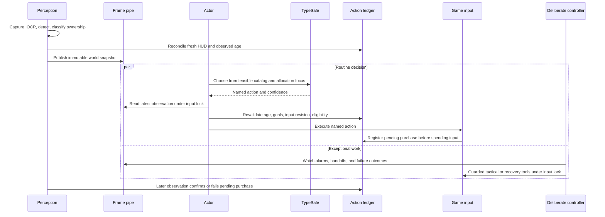

# Chapter 2: Game Loop Pipeline

The gameplay agent has three concurrent loops. Perception publishes immutable observations; the actor selects and executes one named routine action; deliberate work handles combat, tactical handoffs, and bounded recovery. They share an input coordinator and a per-game action ledger.

```mermaid
sequenceDiagram
    participant P as Perception
    participant F as Frame pipe
    participant A as Actor
    participant T as TypeSafe
    participant L as Action ledger
    participant I as Game input
    participant D as Deliberate controller
    P->>P: Capture, OCR, detect, classify ownership
    P->>L: Reconcile fresh HUD and observed age
    P->>F: Publish immutable world snapshot
    par Routine decision
        A->>T: Choose from feasible catalog and allocation focus
        T-->>A: Named action and confidence
        A->>F: Read latest observation under input lock
        A->>L: Revalidate age, goals, input revision, eligibility
        A->>I: Execute named action
        I->>L: Register pending purchase before spending input
    and Exceptional work
        D->>F: Watch alarms, handoffs, and failure outcomes
        D->>I: Guarded tactical or recovery tools under input lock
    end
    P->>L: Later observation confirms or fails pending purchase
```

## 2.1 Perception is authoritative

`loops/perceive.py` is the only writer of observed resources, population, age, idle-worker status, normalized entities, and ownership. `Perception.world` is an immutable `PolicyState` built from the current capture and the ledger. An unreadable field stays unknown; it is not turned into a fresh zero. Model text may become history or a hypothesis, but cannot overwrite observed facts.

Each frame carries a capture time and input revision. A screenshot taken before a game input is not valid evidence for settling that input, even if OCR finishes later. Detector availability is a separate execution policy: interactive play can fall back to local detection, while recorded experiments require the configured detector.

## 2.2 Actor and TypeSafe

For an ordinary frame, the actor builds one immutable request containing the observed snapshot, goals, recent failures, pending commitments, and the currently feasible named actions. TypeSafe returns one action choice and an allocation focus in a single bounded Choice request. The default `AOE2_POLICY_TIMEOUT` is two seconds.

The actor waits outside the input lock. After advice arrives, it reads the newest frame under the lock and rechecks the action. A newer frame alone does not invalidate advice: the action can proceed when its age, goal revision, input revision, alarm status, spatial validity, and catalog eligibility still agree. A changed input, incompatible goal or age, alarm, or unavailable candidate rejects the advice. Timeout, provider failure, low confidence, or rejected advice selects a deterministic fallback from the latest feasible catalog; it does not make a second model call. The execution frame is marked consumed so it is not decided twice.

Alarm frames bypass TypeSafe and go to deliberate combat. The tactical-handoff action can request army use without an alarm. Neither path uses a routine policy decision while another controller holds input.

## 2.3 The shared action catalog

`policy/catalog.py` names the standard land-game actions and their costs, prerequisites, and shipped hotkey bindings. `policy/candidates.py` owns the pure eligibility check. TypeSafe choices, deterministic fallback, recovery tools, and executor preflight all use that catalog. It covers gathering assignment, farms and core economy, Feudal/Castle/Imperial research, prerequisite buildings, six basic military units, and named economy technologies. `wait` remains available. The old 30/35-villager targets are fallback preferences, not executor bans.

The catalog describes the shipped hotkey profile, not a verified local game installation. Binding correctness still requires a controlled Windows in-game smoke test.

## 2.4 Purchase ledger and spatial safety

The per-game `ActionLedger` records one immutable operation immediately before each resource-spending click or keypress, after prerequisite navigation and refresh. It captures a HUD baseline, observation count, input revision, cost reservation, and deadline. Reservations block overspending and duplicate pending purchases, including houses. A successful keypress means only that input was issued; the operation remains pending until later observed evidence confirms payment or its settlement deadline/circuit breaker reports failure. An unchanged early reading stays pending. Observed spend is attributed once. Paid unique prerequisite buildings remain ineligible as completed prerequisites until a new matching building entity is observed; an explicitly enemy-owned sighting is excluded. The ownership classifier currently labels military units, so new entity identity plus purchase evidence is the building signal. Repeatable farms can be started again once their purchase settles. A house completes when population capacity rises. Paid age research remains underway until the observed age changes. Other paid technologies are marked as purchased, not falsely marked complete, because the current perception has no completion signal for them.

Paid unit training releases its resource reservation when the HUD spend settles but keeps one population slot committed until delivered population is observed. All physical input increments a monotonic input revision. Camera-moving input invalidates spatial targets. A dependent click requires a frame captured afterward; refresh has a three-second timeout and returns explicit success or failure. On timeout, the composite action stops without a stale click. A purchase already issued remains in the ledger even if a later verification refresh fails.

## 2.5 Deliberate work and shutdown

The strategist periodically updates goals and allocation. The deliberate executor runs only for combat, a requested tactical handoff, or recovery. Recovery starts after three consecutive failed action attempts or failed settlements, or when food remains critically low for 30 seconds without observed progress. Pending operations and intentional waits do not count as failures. Recovery has a 30-second cooldown and at most three catalog-guarded economic tool actions. The input lock prevents tactical and routine input from overlapping.

On shutdown, the game loop cancels and awaits its child tasks, closes the policy advisor and model providers, and releases the frame source. Decision logs name the request and execution frames, revalidation reason, action ID, reservations, and terminal outcome.

## 2.6 Verification

The production scenario runner (`python -m gameplay_agent.scenario_runner --all`) injects scripted perception, model choices, and low-level input while retaining real candidate filtering, reservations, execution guards, and outcomes. Fixture consequences advance only after the expected spending input. The earlier provider-only fixtures are in `gameplay_agent.provider_scenario_runner`; they are useful for prompt/provider evaluation but do not establish gameplay feasibility. Neither offline runner validates real-game hotkeys or win rate.
