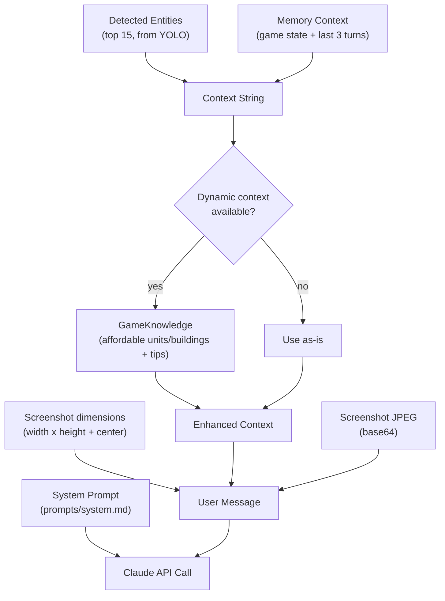

# Chapter 6: Context Injection

Each API call sends more than just a screenshot. The LLM receives layered context: memory from previous turns, detected entities, and optionally dynamic game knowledge tailored to the current game state.

## 6.1 Context Assembly



The context string is built in two stages: the game loop builds the base context (`src/game_loop.py:112-124`), then the Claude provider optionally enhances it with game knowledge (`src/providers/claude.py:100-153`).

## 6.2 Memory System

### Data Structures (`src/memory.py`)

**Turn** (`memory.py:8-17`) -- a single decision cycle:
```python
@dataclass
class Turn:
    iteration: int
    timestamp: str
    reasoning: str
    actions: list[dict]
    observed_resources: dict | None = None
    observed_events: list[str] = field(default_factory=list)
```

**GameState** (`memory.py:20-33`) -- cumulative state:
```python
@dataclass
class GameState:
    resources: dict  # {"food": 0, "wood": 0, "gold": 0, "stone": 0}
    population: int
    population_cap: int
    current_age: str  # "Dark Age", "Feudal Age", etc.
    idle_tc: bool
    under_attack: bool
    enemy_located: bool
    enemy_location: str
```

**AgentMemory** (`memory.py:36-168`) -- the memory manager:
- `working_memory`: `deque(maxlen=10)` -- last 10 turns
- `episode_summary`: string for long-term context (currently unused but plumbed)
- `game_state`: a single `GameState` updated from observations
- `turn_count`: monotonically increasing counter

### Observation Feedback Loop

After each Claude response, `create_turn()` at `memory.py:145-168`:

1. Creates a `Turn` record with reasoning, actions, and extracted observations
2. Calls `update_from_observations()` to update `GameState`
3. Appends the turn to working memory

`update_from_observations()` at `memory.py:60-89` parses the LLM's self-reported observations:

- `resources` dict updates directly
- `population` string like `"12/15"` is split to set `population` and `population_cap`
- `age` string overwrites `current_age`
- Boolean flags (`idle_tc`, `under_attack`) update directly

This creates a feedback loop: the LLM reports what it sees, those observations become context for the next turn, and the LLM can track trends (e.g., resources increasing, population growing).

### Context Formatting

`get_context_for_llm()` at `memory.py:91-118` builds a human-readable context string with three sections:

**Current Game State:**
```
## Current Game State
- Resources: Food=200, Wood=150, Gold=100, Stone=200
- Population: 7/10
- Housed: False
- Age: Dark Age
- TC Idle: True
- Under Attack: False
```

**Episode Summary** (if exists -- currently a placeholder for future use)

**Recent Decisions** (last 3 turns):
```
## Recent Decisions
Turn 1: I see the TC and some sheep. Need to gather food...\n  Actions: press(h), press(q)
Turn 2: Villagers are idle. Sending them to sheep...\n  Actions: press(.), right_click(640,380)
```

The "housed" flag (`memory.py:123`) is computed: `population >= population_cap and population_cap > 0`. When true, it's flagged prominently (`HOUSED (cannot create villagers!)`) to alert the LLM.

## 6.3 Entity Context

Built in the game loop at `src/game_loop.py:116-124`:

```python
if detected_entities:
    entity_context = "\n## Detected Entities\n"
    for entity in detected_entities[:15]:  # Limit to avoid token bloat
        eid = entity.id if hasattr(entity, 'id') else entity.get('id', 'unknown')
        cls = entity.class_name if hasattr(entity, 'class_name') else entity.get('class', 'unknown')
        center = entity.center if hasattr(entity, 'center') else entity.get('center', (0, 0))
        conf = entity.confidence if hasattr(entity, 'confidence') else entity.get('confidence', 0)
        entity_context += f"  {eid}: {cls} at ({int(center[0])},{int(center[1])}) [{conf:.0%}]\n"
    context = entity_context + "\n" + context
```

The 15-entity limit prevents token bloat. Entities are sorted by confidence in the detector (see [Chapter 7](../part3-entity-detection/07-detector-architecture.md)), so the top 15 are the most reliable detections.

Entity context is **prepended** to memory context, so the LLM sees detections first.

## 6.4 Dynamic Game Knowledge

When the game knowledge database is available, `_get_dynamic_context()` at `src/providers/claude.py:100-153` enhances the context:

### Resource Extraction

Parses the memory context using regex to extract current resources and age:

```python
food_match = re.search(r"Food[=:]?\s*(\d+)", context, re.IGNORECASE)
age_match = re.search(r"(Dark|Feudal|Castle|Imperial)\s*Age", context, re.IGNORECASE)
```

Defaults to `{"food": 200, "wood": 200, "gold": 100, "stone": 200}` and `"dark"` if parsing fails.

### Database Queries

With the extracted state, queries the SQLite database:

1. **`get_context_for_state(age, resources)`** -- returns a 200-500 token string listing:
   - Units affordable with current resources at current age
   - Buildings affordable with current resources at current age
   - Counter information for visible enemy units

2. **`get_early_game_priorities()`** -- returns static strategic tips:
   - "Keep TC producing villagers at all times"
   - "Build houses before getting housed"
   - "Scout early to find resources and enemy"

### Context Assembly

The enhanced context prepends dynamic knowledge before the original context:

```python
enhanced_context = f"{dynamic_context}\n{early_game_tips}\n{context}"
```

So the LLM sees: dynamic knowledge > early game tips > detected entities > game state > recent turns.

> **Key Insight**: The dynamic context is resource-aware. If the player has 300 food and 200 wood in Feudal Age, the context lists only units and buildings affordable at those resource levels. This prevents the LLM from trying to build a Castle (650 stone) when it has 0 stone, or training Knights (60 food + 75 gold) when gold is scarce.

## 6.5 Full Context Example

A typical context string sent to Claude (in addition to the screenshot):

```
Screenshot dimensions: 1920x1080 pixels. Center=(960,540). Valid x=0-1920, y=0-1080.

## Available Units (affordable)
- Villager: 50 food (from Town Center)
- Militia: 60 food, 20 gold (from Barracks)

## Available Buildings (affordable)
- House: 25 wood
- Barracks: 175 wood

## Early Game Tips
- Keep TC producing villagers
- Build houses before pop cap

## Detected Entities
  town_center_0: town_center at (960,520) [97%]
  sheep_0: sheep at (640,380) [92%]
  sheep_1: sheep at (680,400) [89%]
  villager_0: villager at (520,310) [88%]
  villager_1: villager at (550,340) [85%]

## Current Game State
- Resources: Food=200, Wood=150, Gold=100, Stone=200
- Population: 5/10
- Housed: False
- Age: Dark Age
- TC Idle: True
- Under Attack: False

## Recent Decisions
Turn 1: Starting game. I see the TC and some sheep...
  Actions: press(h), press(q)

What should I do next?
```

---

## Summary

- Three context layers: memory state, detected entities, dynamic game knowledge
- Working memory keeps last 10 turns; LLM sees last 3
- Observation feedback loop: LLM reports state, memory tracks it, next turn sees updates
- Dynamic context filters by current age and resources
- 15-entity cap prevents token bloat

## Related Topics

- [Chapter 2: Game Loop Pipeline](../part1-architecture/02-game-loop-pipeline.md) -- where context is built
- [Chapter 4: Provider Pattern](./04-provider-pattern.md) -- where context is sent to Claude
- [Chapter 10: Knowledge Database](../part4-game-knowledge/10-knowledge-database.md) -- the SQLite backend for dynamic queries
