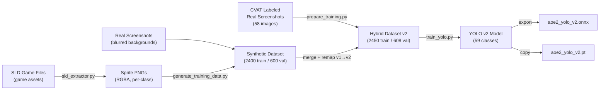

# Chapter 8: Training Pipeline

The YOLO model is trained on a hybrid dataset: synthetic images generated from extracted game sprites, plus real screenshots labeled in CVAT. This chapter covers synthetic data generation, augmentation, and the YOLO training process.

## 8.1 Pipeline Overview



## 8.2 Synthetic Data Generation

`detection/training/generate_training_data.py` generates labeled training images by compositing sprites onto backgrounds.

### Sprite Configurations

46 sprite configurations define how each entity type appears in generated images. Each config specifies:

| Field | Example | Purpose |
|-------|---------|---------|
| `class_id` | `8` | YOLO class ID (v1 schema during generation) |
| `class_name` | `"sheep"` | Human-readable name |
| `sprite_patterns` | `["u_sheep_idle*_x1.sld"]` | Glob patterns for sprite files |
| `scale_range` | `(0.8, 1.2)` | Random size variation |
| `count_range` | `(2, 6)` | Min/max instances per image |
| `z_order` | `2` | Rendering layer (0=back, 3=front) |
| `avoid_edges` | `True` | Keep sprites away from image borders |
| `min_spacing` | `30` | Minimum distance between same-class instances |

### Z-Order Layering

Sprites are rendered in z-order to simulate realistic occlusion:

| z_order | Category | Examples |
|---------|----------|----------|
| 0 | Resources | trees, gold mines, stone mines |
| 1 | Buildings | town center, barracks, houses |
| 2 | Animals | sheep, deer, boar, wolf |
| 3 | Units | villagers, scouts, military units |

### Placement Algorithm

For each image generation:

1. Sort sprite configs by z_order
2. For each config, pick random count from `count_range`
3. For each sprite instance:
   - Apply random scale from `scale_range`
   - Try up to 20 random positions
   - Check IoU overlap with existing sprites (threshold: 0.4)
   - Accept position if overlap is acceptable
4. Paste sprite with alpha transparency
5. Generate YOLO-format label: `class_id x_center y_center width height` (all normalized 0-1)

### Background Sources

Three background types, selected randomly per image:

1. **Real screenshots** (50% probability via `real_background_ratio=0.5`) -- actual game screenshots from `detection/real_screenshots/raw/`, Gaussian-blurred with radius=1 to reduce overfitting on specific game states while preserving terrain colors and textures.

2. **Synthetic backgrounds** -- pre-generated terrain images.

3. **Procedural terrain** -- generated at runtime with 20 random green-toned elliptical patches (200-500px) and Gaussian blur (radius=3).

## 8.3 Augmentation Pipeline

### Basic Augmentations

Applied with independent probabilities per image:

| Augmentation | Probability | Parameters | Purpose |
|--------------|-------------|------------|---------|
| Brightness | 50% | 0.7-1.3x | Day/night, shadows |
| Contrast | 50% | 0.8-1.2x | Monitor variation |
| Saturation | 30% | 0.8-1.2x | Color variation |
| Gaussian blur | 20% | radius=0.5 | Slight defocus |

### Enhanced Augmentations (v2)

Game-realistic effects that simulate actual screenshot conditions:

**Fog of War** (30% chance) -- 1-4 dark patches at image edges with opacity 80-150, simulating unexplored areas at map borders.

**UI Element Simulation** (20% chance) -- dark rectangles mimicking the minimap (130-180px at corner) and resource bar (25-40px at top). Teaches the model to ignore UI overlays.

**JPEG Compression** (30% chance) -- re-encodes at quality 70-90, simulating screenshot compression artifacts.

**Scale Variation** (30% chance) -- 0.7-1.3x zoom with center crop or padding. Simulates different camera zoom levels and screen resolutions.

**Color Temperature** (20% chance) -- warm shift (boost R, reduce B) for desert maps or cool shift (reduce R, boost B) for winter maps.

**Vignette** (15% chance) -- radial gradient darkening at edges, simulating viewport effects.

> **Key Insight**: The `flipud=0.0` setting in YOLO training is deliberate. AoE2 uses an isometric camera at a fixed angle -- units never appear upside-down. Vertical flipping would create unrealistic training samples with upside-down buildings and units, confusing the model. Horizontal flip (`fliplr=0.5`) is fine because units face both left and right.

## 8.4 YOLO Training

`detection/training/train_yolo.py` trains a YOLO11 nano model:

### Model

Base model: `yolo11n.pt` (YOLO11 nano) -- ~6MB, optimized for real-time inference on consumer hardware. The nano variant was chosen for speed; each detection call needs to complete within the 2-second loop cycle.

### Hyperparameters

Tuned for isometric game graphics:

| Parameter | Value | Rationale |
|-----------|-------|-----------|
| `epochs` | 150 | Sufficient for convergence with early stopping |
| `batch` | 16 | Fits in GPU memory (A100 40GB) |
| `imgsz` | 640 | Standard YOLO input size |
| `patience` | 20 | Early stopping patience |
| `hsv_h` | 0.015 | Slight hue variation |
| `hsv_s` | 0.7 | Saturation augmentation |
| `hsv_v` | 0.4 | Brightness augmentation |
| `degrees` | 10 | Small rotation (units face different directions) |
| `translate` | 0.1 | Position shift |
| `scale` | 0.5 | Zoom variation |
| `flipud` | 0.0 | **No vertical flip** (isometric constraint) |
| `fliplr` | 0.5 | Horizontal flip OK |
| `mosaic` | 1.0 | Full mosaic augmentation |
| `mixup` | 0.1 | Light MixUp for regularization |

### Dataset Structure

```
training_data_v2/
├── train/
│   ├── images/   # 2450 images (2400 synthetic + 50 real)
│   └── labels/   # YOLO .txt files (class_id cx cy w h)
├── val/
│   ├── images/   # 608 images (600 synthetic + 8 real)
│   └── labels/
└── dataset.yaml  # Paths + class names
```

### Output

Training produces:
- `runs/aoe2_yolo_v2/weights/best.pt` -- best validation mAP checkpoint
- Optionally exported to ONNX with `--export-onnx` flag
- Copied to `detection/inference/models/aoe2_yolo_v2.pt` and `.onnx`

### Results

v1 model (synthetic only): **86% mAP50** on synthetic validation data, 46 classes.
v2 model (hybrid): 59 classes with real data integration. See [Chapter 12](../part5-operations/12-cloud-training.md) for cloud training details.

---

## Summary

- Synthetic data: sprite compositing with z-order, overlap management, 3 background types
- 6 enhanced augmentations simulating real game conditions (fog, UI, compression, zoom, temperature, vignette)
- YOLO11 nano model: 150 epochs, isometric-tuned hyperparameters
- Hybrid dataset: 2450 train (2400 synthetic + 50 real) / 608 val

## Related Topics

- [Chapter 7: Detector Architecture](./07-detector-architecture.md) -- how the trained model is used at runtime
- [Chapter 9: Labeling & Active Learning](./09-labeling-and-active-learning.md) -- how real data is labeled and merged
- [Chapter 11: Sprite Extraction](../part4-game-knowledge/11-sprite-extraction.md) -- how sprites are extracted from game files
- [Chapter 12: Cloud Training](../part5-operations/12-cloud-training.md) -- Lambda Labs training workflow
