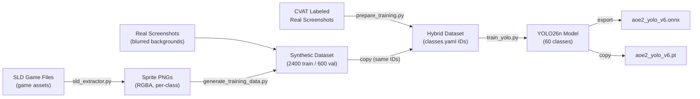

# Chapter 8: Training Pipeline

The YOLO model is trained on a hybrid dataset: synthetic images generated from extracted game sprites, plus real screenshots labeled in CVAT. This chapter covers synthetic data generation, augmentation, and the YOLO training process.

<aside class="prereqs">

[Appendix A — YOLO and object detection](../appendix/01-yolo-and-object-detection.md) for the underlying model and what mAP measures. [Chapter 11 — Sprite Extraction](../part4-game-knowledge/11-sprite-extraction.md) for where the synthetic-data sprites come from.

</aside>

## 8.1 Pipeline Overview


```mermaid
flowchart LR
    SLD["SLD Game Files<br/>(game assets)"] -->|sld_extractor.py| PNG["Sprite PNGs<br/>(RGBA, per-class)"]
    BG["Real Screenshots<br/>(blurred backgrounds)"] --> GEN
    PNG -->|generate_training_data.py| GEN["Synthetic Dataset<br/>(2400 train / 600 val)"]
    CVAT["CVAT Labeled<br/>Real Screenshots"] -->|prepare_training.py| MERGE["Hybrid Dataset<br/>(classes.yaml IDs)"]
    GEN -->|"copy (same IDs)"| MERGE
    MERGE -->|train_yolo.py| MODEL["YOLO26n Model<br/>(60 classes)"]
    MODEL -->|export| ONNX["aoe2_yolo_v6.onnx"]
    MODEL -->|copy| PT["aoe2_yolo_v6.pt"]
```

## 8.2 Synthetic Data Generation

`packages/detection/src/training/generate_training_data.py` generates labeled training images by compositing sprites onto backgrounds.

### Sprite Configurations

53 sprite configurations define how each entity type appears in generated images. Each config specifies:

| Field | Example | Purpose |
|-------|---------|---------|
| `class_id` | `8` | YOLO class ID (matches classes.yaml directly) |
| `class_name` | `"sheep"` | Human-readable name |
| `sprite_patterns` | `["u_sheep_idle*_x1.sld"]` | Glob patterns for sprite files |
| `scale_range` | `(0.8, 1.2)` | Random size variation |
| `count_range` | `(2, 6)` | Min/max instances per image |
| `z_order` | `2` | Rendering layer (0=back, 3=front) |
| `avoid_edges` | `True` | Keep sprites away from image borders |
| `min_spacing` | `30` | Minimum distance between same-class instances |

### Z-Order Layering

Sprites are rendered in z-order to simulate realistic occlusion:

| z_order | Category | Examples |
|---------|----------|----------|
| 0 | Resources | trees, gold mines, stone mines |
| 1 | Buildings | town center, barracks, houses |
| 2 | Animals | sheep, deer, boar, wolf |
| 3 | Units | villagers, scouts, military units |

### Placement Algorithm

For each image generation:

1. Sort sprite configs by z_order
2. For each config, pick random count from `count_range`
3. For each sprite instance:
   - Apply random scale from `scale_range`
   - Try up to 20 random positions
   - Check overlap with z-order-aware thresholds: buildings 10%, resources 15%, units 35%
   - **Skip placement** if overlap limit exceeded (no force-place)
4. Paste sprite with alpha transparency
5. Generate YOLO-format label: `class_id x_center y_center width height` (all normalized 0-1)

> **v5 improvement**: Z-order-aware overlap thresholds replaced the flat 40% IoU threshold from earlier versions. Buildings overlap less (10%) since they're large and static, while units tolerate more overlap (35%) since they cluster in groups. Sprites that can't find a valid position are skipped entirely rather than force-placed, reducing label noise.

### Dataset-Level Class Rebalancing

ultralytics exposes no per-class loss weighting, so we balance the **data** instead of the loss. Each sprite config carries an `oversample_weight` that multiplies its per-image instance count: rare and confusable classes simply appear more often across the dataset.

Two groups get boosted:

- **Rare unique units** — `unique_archer`..`unique_ship` (class IDs 50–54). These civ-specific units show up in only a handful of real screenshots, so synthetic oversampling keeps them from being starved.
- **Confusable cavalry** — `camel_line` (35), `cavalry_archer` (39), and `battle_elephant` (36). These are visually close to the scout/knight lines and need more examples to separate cleanly.

The helper `effective_count_range()` applies the weight to the config's base `count_range` at generation time, so a class with `oversample_weight=3` and `count_range=(1, 2)` contributes roughly three times the instances per image.

### Distant-Unit Augmentation

YOLO's small-object struggles aren't only an architecture problem — if the training set never shows a ~20px sheep, the model can't learn to find one. A per-config `distant_fraction` renders that fraction of mobile-unit instances small (around 20px) using a dedicated "distant" scale band. `scale_bounds()` picks the band (normal vs. distant) and the generator draws a concrete scale within it (`random.uniform(*scale_bounds(...))`), so a slice of villagers, sheep, and cavalry are composited at genuine distant-camera sizes.

This is the dataset-level complement to YOLO26's small-object STAL head: STAL improves the detector's *capacity* for tiny objects, while `distant_fraction` guarantees the *data* actually contains them.

### Background Sources

Three background types, selected randomly per image:

1. **Real screenshots** (50% probability via `real_background_ratio=0.5`) -- actual game screenshots from `packages/detection/src/real_screenshots/raw/`, Gaussian-blurred with radius=1 to reduce overfitting on specific game states while preserving terrain colors and textures.

2. **Synthetic backgrounds** -- pre-generated terrain images.

3. **Procedural terrain** -- generated at runtime with biome-aware color palettes. A biome is selected randomly (weighted) from 9 types: grass (25%), desert (15%), snow (10%), autumn (10%), jungle (10%), dirt (10%), mixed (10%), water_shore (5%), dark_forest (5%). Each biome defines 5 terrain colors used for 20 elliptical patches (200-500px) with Gaussian blur (radius=3). The "mixed" biome merges colors from 2-3 random biomes.

<details class="deep-dive">
<summary>Deep dive — Designing synthetic training data (why these numbers, not other numbers)</summary>

The four numbers most likely to make a beginner squint at this chapter are: **z-order layers**, the **z-order-aware overlap thresholds (10% / 15% / 35%)**, the **50% real-background mix**, and the **JPEG-compression augmentation**. Each is a small deliberate choice that addresses a specific failure mode we've observed.

**Z-order layers (0–3).** Real game scenes have a depth order: trees grow up from the ground, units walk on top of the ground, buildings sit at intermediate depth. If you composite sprites in random order, you end up with sheep painted *over* trees that should be in front of them — a visual configuration the model would never see in a real screenshot. Painting buildings first, then resources, then animals, then units mirrors AoE2's actual rendering pipeline and produces training images that look like real game scenes. **The model learns the partial-occlusion patterns it'll encounter at inference.**

**Why three different overlap thresholds.** Earlier versions used a flat "boxes can overlap by at most 40% IoU" rule and got systematic label noise: stacked villagers ended up with their boxes overlapping enough that NMS would later treat them as duplicates. The per-class thresholds capture an observable fact about the game:

- *Buildings (10%)* are large, static, and never genuinely overlap in-game (you can't build through walls). Allowing 10% gives us a tolerance for the small inaccuracies in extracted sprite bounds.
- *Resources (15%)* — trees and animals can cluster but mostly stay distinct.
- *Units (35%)* — villagers and military units cluster heavily, and the model *needs* to be able to count them when they're packed together.

The "skip rather than force-place" rule is just as important: if 20 random positions can't satisfy the overlap constraint, drop the sprite. Better to have fewer training instances than to introduce a malformed label that pushes the network in the wrong direction.

**The 50% real-background mix.** Pure synthetic backgrounds let the network cheat: it can learn "this is a sheep because the background is solid green," which fails the moment a real screenshot has a different terrain. Mixing in actual blurred screenshots forces the network to find the *foreground sprite* against authentic visual noise (UI fragments, terrain transitions, fog). Blurring the backgrounds (Gaussian radius=1) keeps the terrain colors and global structure but destroys high-frequency texture — so the network can't memorize specific real game states.

**JPEG compression as augmentation.** Real screenshots are saved as JPEG before reaching the detector. If you train only on lossless PNG composites, your model is mildly fragile at inference because it never saw the JPEG ringing artifacts around sprite edges. A 30% probability of re-encoding the training image at quality 70–90 closes the gap.

**The meta-lesson.** Every one of these knobs corresponds to a failure mode we caught either in unit tests on labels or in the form of a falling mAP curve during training. Synthetic data design is *the* practical leverage point for object detection — it's almost always cheaper to fix the data than to change the architecture.

</details>

## 8.3 Augmentation Pipeline

### Basic Augmentations

Applied with independent probabilities per image:

| Augmentation | Probability | Parameters | Purpose |
|--------------|-------------|------------|---------|
| Brightness | 50% | 0.7-1.3x | Day/night, shadows |
| Contrast | 50% | 0.8-1.2x | Monitor variation |
| Saturation | 30% | 0.8-1.2x | Color variation |
| Gaussian blur | 20% | radius=0.5 | Slight defocus |

### Enhanced Augmentations (v2)

Game-realistic effects that simulate actual screenshot conditions:

**Fog of War** (30% chance) -- 1-4 dark patches at image edges with opacity 80-150, simulating unexplored areas at map borders.

**UI Element Simulation** (20% chance) -- dark rectangles mimicking the minimap (130-180px at corner) and resource bar (25-40px at top). Teaches the model to ignore UI overlays.

**JPEG Compression** (30% chance) -- re-encodes at quality 70-90, simulating screenshot compression artifacts.

**Scale Variation** (30% chance) -- 0.7-1.3x zoom with center crop or padding. Simulates different camera zoom levels and screen resolutions.

**Color Temperature** (20% chance) -- warm shift (boost R, reduce B) for desert maps or cool shift (reduce R, boost B) for winter maps.

**Vignette** (15% chance) -- radial gradient darkening at edges, simulating viewport effects.

> **Key Insight**: The `flipud=0.0` setting in YOLO training is deliberate. AoE2 uses an isometric camera at a fixed angle -- units never appear upside-down. Vertical flipping would create unrealistic training samples with upside-down buildings and units, confusing the model. Horizontal flip (`fliplr=0.5`) is fine because units face both left and right.

## 8.4 YOLO Training

`packages/detection/src/training/train_yolo.py` trains a YOLO26 nano model (defaults: `--model yolo26n.pt --name aoe2_yolo_v6`):

### Model

Base model: `yolo26n.pt` (YOLO26 nano) -- ~6MB, optimized for real-time inference on consumer hardware. The nano variant was chosen for speed; each detection call needs to complete within the 2-second loop cycle. YOLO26 is **NMS-free**: it drops the non-maximum-suppression head and emits final boxes directly, which simplifies the export path. (NMS-style dedup still happens where it's *our* logic — e.g. merging overlapping SAHI tile detections.) YOLO26 also ships a small-object STAL head, which the distant-unit augmentation above is designed to feed.

### Hyperparameters

Tuned for isometric game graphics:

| Parameter | Value | Rationale |
|-----------|-------|-----------|
| `epochs` | 150 | Sufficient for convergence with early stopping |
| `batch` | 16 | Fits in GPU memory (A100 40GB) |
| `imgsz` | 640 | Standard YOLO input size |
| `patience` | 20 | Early stopping patience |
| `hsv_h` | 0.015 | Slight hue variation |
| `hsv_s` | 0.7 | Saturation augmentation |
| `hsv_v` | 0.4 | Brightness augmentation |
| `degrees` | 10 | Small rotation (units face different directions) |
| `translate` | 0.1 | Position shift |
| `scale` | 0.5 | Zoom variation |
| `flipud` | 0.0 | **No vertical flip** (isometric constraint) |
| `fliplr` | 0.5 | Horizontal flip OK |
| `mosaic` | 1.0 | Full mosaic augmentation |
| `mixup` | 0.1 | Light MixUp for regularization |

### Loss-Gain Knobs

`train_yolo.py` exposes three optional overrides for ultralytics' loss-component weights: `--cls-gain`, `--box-gain`, and `--dfl-gain`. They default to the model's built-in values and only take effect when passed.

The classification gain is the lever for the confusable cavalry lines: raising `--cls-gain` biases the optimizer toward classification accuracy (telling camel from scout from knight) at the margin, trading off a little localization sharpness. This is the one *native* ultralytics control for class confusion — the dataset-level rebalancing above does the rest.

### Dataset Structure

```
training_data/
├── train/
│   ├── images/   # hybrid: synthetic + real tiles
│   └── labels/   # YOLO .txt files (class_id cx cy w h)
├── val/
│   ├── images/
│   └── labels/
└── dataset.yaml  # Paths + 60 class names (classes.yaml IDs)
```

### Output

Training produces:
- `runs/aoe2_yolo_v6/weights/best.pt` -- best validation mAP checkpoint
- Optionally exported to ONNX with `--export-onnx` flag
- Copied to `packages/detection/src/inference/models/aoe2_yolo_v6.pt` and `.onnx`

### Results

**v6 (YOLO26n) has shipped** — `aoe2_yolo_v6.onnx` / `.pt` are the deployed artifacts. v6 moved off the large mixed v5 corpus to a smaller, real-terrain-backed synthetic set (~2400 synthetic) merged with **187 real CVAT screenshots**, trained at `imgsz=640` (the resolution the agent infers at — see [Chapter 7 §7.4](./07-detector-architecture.md)).

**Two metrics, deliberately separated.** Synthetic-validation mAP50 flatters the model; the metric of record is **real** F1, measured by `evaluate_real.py` (Chapter 7 §7.13):

| Metric | v6 value | Notes |
|--------|----------|-------|
| Synthetic-val mAP50 (overall) | **~0.834** | after the water-scene fix (was 0.827 synthetic-only) |
| `fish` synthetic mAP50 | **0.545** | up from **0.146** once fish/naval were composited only on water |
| **Real micro-F1** (single-pass @640) | **≈ 0.42** | P 0.65 / R 0.31 — the realistic number; rare military lines still near-zero recall |

> **Historical (v5, YOLO11n):** 92.2% mAP50 / 85.4% mAP50-95 on an 18,520-image hybrid set. These are *synthetic-heavy validation* numbers and are **not** comparable to v6's real-F1 figure — they're kept only as a lineage marker.

#### v6 sim-to-real levers

Three changes drove the move from "great synthetic mAP, poor real recall" toward real performance (full procedure in the [retrain runbook](../runbooks/retrain-detection-v6.md)):

- **Water-scene mode.** Fish/naval classes (`fishing_ship`, `unique_ship`, `fish`, `galley`, `fire_galley`) are composited **only** on real water textures and removed from land scenes (`--water-backgrounds` + `--water-fraction`). Fish/naval-on-grass was a scene that never occurs in-game and capped `fish` at 0.146 mAP50; the fix lifted it to 0.545. The general rule: *if a class only exists in a specific scene, place it only in that scene.*
- **Real-data oversampling.** `--oversample-real N` duplicates each real **train** pair N× (val never duplicated, so metrics stay honest), so the ~187 real images aren't drowned out by ~2400 synthetic ones in the loss.
- **Synthetic UI overlays.** Selection ellipses, health bars, garrison badges, and a bottom command-panel HUD are layered on the synthetic frames so the model isn't brittle to artifacts that only appear in *real* screenshots.

See [Chapter 12](../part5-operations/12-cloud-training.md) for cloud training details.

## 8.5 Targeted Data Improvement

Once a model exists, the cheapest way to improve it is to feed it *the data it's bad at*, rather than more random data. Two tools close that loop.

**Hard-negative mining.** `python -m detection.labeling.hard_negatives --max-conf 0.5` (in `packages/detection/src/labeling/hard_negatives.py`) reuses the active-learning triage machinery to surface low-confidence detections on the confusable cavalry lines — scout, knight, camel, battle_elephant, and cavalry_archer. Any detection below the `--max-conf` threshold is pulled out for targeted human re-labeling in CVAT, so correction effort lands exactly where the model is weakest.

**Open-vocabulary auto-labeling.** For unlabeled screenshots, `prelabel.py --open-vocab {yoloe,dinox}` bootstraps a first draft of labels using an open-vocabulary detector — YOLOE (local) or DINO-X (hosted) — mapping its outputs onto `classes.yaml` IDs. Those pre-labels feed the existing CVAT → human correction → `prepare_training()` loop, so a fresh batch of screenshots starts most of the way labeled instead of from scratch. This requires the new `autolabel` optional extra. See [Chapter 9](./09-labeling-and-active-learning.md) for the full labeling and active-learning workflow.

> **Note on the generator.** The legacy duplicate `training/synthetic_data.py` has been **deleted**; `generate_training_data.py` is now the single canonical synthetic-data generator.

---

## Summary

- Synthetic data: sprite compositing with z-order, z-order-aware overlap thresholds (buildings 10%, resources 15%, units 35%)
- 53 sprite configs using classes.yaml IDs directly (no remapping needed); `generate_training_data.py` is the single canonical generator
- Dataset-level rebalancing (`oversample_weight` / `effective_count_range()`) boosts rare unique units (50–54) and confusable cavalry (35, 36, 39), since ultralytics has no per-class loss weighting
- Distant-unit augmentation (`distant_fraction` / `scale_bounds()`) puts genuine ~20px units in the data, complementing YOLO26's small-object STAL head
- 17+ architecture styles per building via wildcard patterns
- 6 enhanced augmentations simulating real game conditions (fog, UI, compression, zoom, temperature, vignette)
- YOLO26 nano model (`yolo26n.pt`, NMS-free): 150 epochs at `imgsz=640`, isometric-tuned hyperparameters, optional `--cls-gain/--box-gain/--dfl-gain` loss-weight overrides
- v6 sim-to-real levers: **water-scene mode** (fish 0.146 → 0.545 mAP50), **`--oversample-real`**, and synthetic **UI overlays**
- Targeted data improvement: hard-negative mining (`labeling/hard_negatives.py`) and open-vocab auto-labeling (`prelabel.py --open-vocab`)
- v6 (YOLO26n) shipped; synthetic-val mAP50 ~0.834, but the metric of record is **real F1 ≈ 0.42** (`evaluate_real.py`, single-pass @640)

## Related Topics

- [Chapter 7: Detector Architecture](./07-detector-architecture.md) -- how the trained model is used at runtime
- [Chapter 9: Labeling & Active Learning](./09-labeling-and-active-learning.md) -- how real data is labeled and merged
- [Chapter 11: Sprite Extraction](../part4-game-knowledge/11-sprite-extraction.md) -- how sprites are extracted from game files
- [Chapter 12: Cloud Training](../part5-operations/12-cloud-training.md) -- cloud GPU training workflow (RunPod is the tested path; Lambda alternative)
