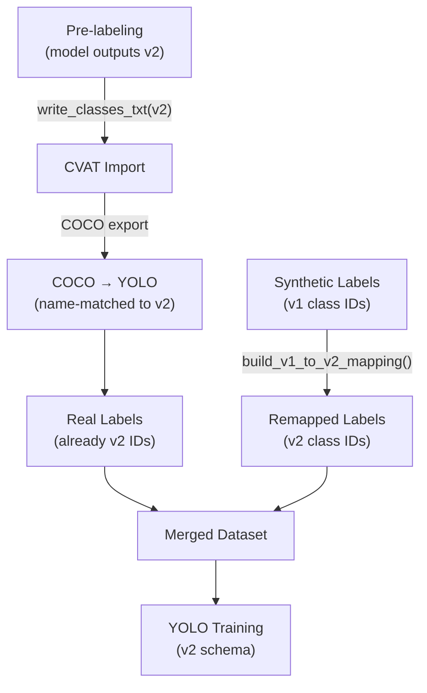

# Chapter 13: Class Schema Evolution

The detection system has two class schemas with different ID assignments. Mixing them without remapping corrupts training data. This chapter explains why two schemas exist, how they differ, and where remapping occurs.

## 13.1 Why Two Schemas

### v1 Schema (46 classes)

The original training schema, defined in `detection/training_data/dataset.yaml`. Created when the first synthetic dataset was generated. Class IDs were assigned in a different order than the final taxonomy:

| ID | Class | ID | Class |
|----|-------|----|-------|
| 0 | tree | 19 | sheep |
| 1 | gold_mine | 5 | town_center |
| 2 | stone_mine | 43 | longbowman |
| 3 | berry_bush | 44 | mangudai |
| 4 | relic | 45 | war_wagon |

The v1 model was trained on this schema and achieved 86% mAP50 on synthetic data.

### v2 Schema (59 classes)

The reorganized target schema, defined in `detection/training/config/classes.yaml` (source of truth). Key changes:

1. **Reordered IDs** -- classes reorganized by category (resources 0-8, economy buildings 9-16, military buildings 17-24, etc.)
2. **Unique unit grouping** -- v1 had individual unique units (longbowman, mangudai, war_wagon); v2 groups them by combat type (unique_archer, unique_cavalry, unique_siege)
3. **New classes** -- 13 classes added that weren't in v1, including 4 added in Feb 2026:
   - `fish` (55), `galley` (56), `fire_galley` (57), `siege_tower` (58)

### Example ID Mismatches

| Entity | v1 ID | v2 ID |
|--------|-------|-------|
| sheep | 19 | 8 |
| town_center | 5 | 9 |
| barracks | 14 | 17 |
| villager | 17 | 30 |
| scout_line | 18 | 33 |
| longbowman | 43 | *(mapped to unique_archer=50)* |

If synthetic labels (v1 IDs) are mixed with real labels (v2 IDs) without remapping, the model learns incorrect class assignments. For example, what the v1 schema calls class 19 (sheep) the v2 schema calls class 19 (stable) -- a completely different entity.

> **Key Insight**: The class ID mismatch between v1 and v2 is the most dangerous data integrity issue in the project. If synthetic labels are mixed with real labels without remapping, the model will learn completely wrong class assignments. The `prepare_training.py` merge script handles this automatically, but any manual label manipulation must account for which schema is in use.

## 13.2 The Mapping Utility

`detection/labeling/class_mapping.py` provides bidirectional mapping.

### Core Functions

**`load_classes_yaml()`** (`class_mapping.py:18-28`) -- loads the v2 59-class schema. Returns `{id: name}` dict.

**`load_dataset_yaml()`** (`class_mapping.py:31-41`) -- loads the v1 46-class schema. Returns `{id: name}` dict.

**`build_v1_to_v2_mapping()`** (`class_mapping.py:44-81`) -- builds the mapping:

1. Creates a `name → id` reverse lookup for v2
2. For each v1 class, looks up the same name in v2
3. Special handling via `_UNIQUE_MAP` for unique units:

```python
_UNIQUE_MAP = {
    "longbowman": "unique_archer",    # v1:43 → v2:50
    "mangudai": "unique_archer",       # v1:44 → v2:50
    "war_wagon": "unique_siege",       # v1:45 → v2:53
}
```

Result: ~42 classes map directly by name, 3 unique units map via `_UNIQUE_MAP`, 4 v1 classes have no v2 equivalent (dropped).

**`build_v2_to_v1_mapping()`** (`class_mapping.py:84-94`) -- inverse mapping. Note: unique units collapse (unique_archer maps to whichever v1 unique was processed last).

**`convert_label_file()`** (`class_mapping.py:126-159`) -- rewrites a YOLO `.txt` label file, replacing class IDs per the mapping. Lines with unmappable classes are skipped.

### CVAT Support

**`get_classes_for_cvat(schema)`** (`class_mapping.py:97-112`) -- generates an ordered class name list for CVAT project import. Supports both v1 and v2 schemas.

**`write_classes_txt()`** (`class_mapping.py:115-123`) -- writes the `classes.txt` file that CVAT needs when importing YOLO labels.

## 13.3 Where Remapping Occurs



### In prepare_training.py

During the hybrid merge (`detection/labeling/prepare_training.py`), synthetic labels are remapped on copy:

1. Builds v1→v2 mapping via `build_v1_to_v2_mapping()`
2. For each synthetic label file:
   - Reads each line
   - Replaces the class ID using the mapping
   - Writes to the output directory
3. Real labels (already in v2 schema) are copied unchanged

### In prelabel.py

When pre-labeling raw screenshots for CVAT import, the current model's output class IDs are used directly (already v2 if using v2 model). The `classes.txt` is generated from the v2 schema.

### In COCO conversion

CVAT COCO exports use 1-indexed category IDs with names. The conversion matches by **name**, not numeric ID, which handles the COCO 1-indexing vs YOLO 0-indexing difference transparently.

## 13.4 The Source of Truth

`detection/training/config/classes.yaml` is the single source of truth for the class taxonomy:

- **YOLO training** -- `dataset.yaml` references these class names
- **CVAT import** -- `get_classes_for_cvat()` reads from this file
- **Detector inference** -- `DEFAULT_CLASSES` in `detector.py` mirrors this file
- **Pre-labeling** -- `write_classes_txt()` generates CVAT-compatible format from this file

Any class additions, removals, or renamings must update `classes.yaml` first. All other code derives from it.

## 13.5 Adding New Classes

1. Add the new class to `classes.yaml` with the next available ID
2. Update `DEFAULT_CLASSES` in `detector.py` to match
3. Extract sprites for the new class (if generating synthetic data)
4. Add sprite config to `generate_training_data.py`
5. Regenerate synthetic dataset
6. Re-merge with real data via `prepare_training.py`
7. Retrain the model

Recent additions (Feb 2026): fish (55), galley (56), fire_galley (57), siege_tower (58).

---

## Summary

- Two schemas: v1 (46 classes, original IDs) and v2 (59 classes, reorganized)
- Name-based mapping handles ID mismatches between schemas
- Unique units collapsed: longbowman/mangudai → unique_archer, war_wagon → unique_siege
- Remapping happens automatically in `prepare_training.py` during dataset merge
- `classes.yaml` is the single source of truth for the taxonomy
- Mixing schemas without remapping corrupts training data

## Related Topics

- [Chapter 7: Detector Architecture](../part3-entity-detection/07-detector-architecture.md) -- the 59-class taxonomy at runtime
- [Chapter 9: Labeling & Active Learning](../part3-entity-detection/09-labeling-and-active-learning.md) -- where remapping integrates with CVAT exports
- [Chapter 8: Training Pipeline](../part3-entity-detection/08-training-pipeline.md) -- how the remapped dataset is used for training
