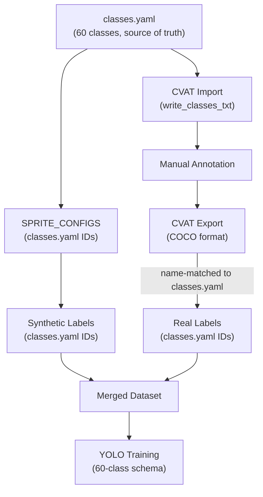

# Chapter 13: Class Schema Evolution

The detection system uses a single class schema defined in `classes.yaml` with 60 classes. This chapter explains the schema history and the current unified approach. (The legacy v1→v2 mapping code has been removed — the pipeline is single-schema now.)

<aside class="prereqs">

[Chapter 7 — Detector Architecture](../part3-entity-detection/07-detector-architecture.md) for the current 60-class taxonomy whose history this chapter explains.

</aside>

## 13.1 Schema History

### v1 Schema (46 classes) — Legacy

The original training schema, defined in `packages/detection/src/training_data/dataset.yaml`. Created when the first synthetic dataset was generated. Class IDs were assigned in a different order than the final taxonomy, and unique units were individual classes (longbowman, mangudai, war_wagon).

### v2/Current Schema (60 classes)

The reorganized schema, defined in `packages/detection/src/training/config/classes.yaml` (source of truth). Key changes from v1:

1. **Reordered IDs** — classes organized by category (resources 0-8, economy buildings 9-16, military buildings 17-24, etc.)
2. **Unique unit grouping** — individual unique units replaced with 5 type-based groups: unique_archer, unique_cavalry, unique_infantry, unique_siege, unique_ship
3. **14 new classes** added over time, including fish (55), galley (56), fire_galley (57), siege_tower (58), goose (59)

### Unified Class IDs

As of v5, all data sources use `classes.yaml` IDs directly:

- **Synthetic training data** — `generate_training_data.py` SPRITE_CONFIGS use classes.yaml IDs (e.g., sheep=8, town_center=9)
- **CVAT annotations** — labeled with classes.yaml names, converted by name-matching
- **Pre-labels** — `prelabel.py` writes classes.yaml IDs directly (the model is trained on classes.yaml IDs)
- **Merged datasets** — `prepare_training.py` copies synthetic labels directly (no remapping needed)

This eliminates the v1/v2 ID mismatch that previously required remapping during dataset merges.

## 13.2 The Mapping Utility

`packages/detection/src/labeling/class_mapping.py` provides utilities for class schema operations.

### Core Functions

**`load_classes_yaml()`** — loads the 60-class schema. Returns `{id: name}` dict.

> The legacy v1 mapping helpers (`load_dataset_yaml`, `build_v1_to_v2_mapping`, `convert_label_file`) were **removed** once the pipeline went single-schema: YOLO26/v6 emits classes.yaml IDs natively, so there is only one scheme and nothing to map between.

### CVAT Support

**`get_classes_for_cvat()`** — generates an ordered class name list for CVAT project import.

**`write_classes_txt()`** — writes the `classes.txt` file that CVAT needs when importing YOLO labels.

## 13.3 Data Flow

```mermaid
flowchart TD
    YAML["classes.yaml<br/>(60 classes, source of truth)"] --> SPRITES["SPRITE_CONFIGS<br/>(classes.yaml IDs)"]
    SPRITES --> SYN["Synthetic Labels<br/>(classes.yaml IDs)"]
    SYN --> MERGE["Merged Dataset"]

    YAML --> CVAT_IMPORT["CVAT Import<br/>(write_classes_txt)"]
    CVAT_IMPORT --> ANNOTATE["Manual Annotation"]
    ANNOTATE --> CVAT_EXPORT["CVAT Export<br/>(COCO format)"]
    CVAT_EXPORT -->|"name-matched to classes.yaml"| REAL["Real Labels<br/>(classes.yaml IDs)"]
    REAL --> MERGE

    MERGE --> TRAIN["YOLO Training<br/>(60-class schema)"]
```

### In prepare_training.py

During the hybrid merge, synthetic labels are copied directly (no remapping needed since they already use classes.yaml IDs). Real labels from CVAT exports are converted by name-matching.

### In prelabel.py

The model (YOLO26/v6) emits classes.yaml IDs directly, so `prelabel.py` writes them straight to CVAT-compatible labels with no remapping. Detections whose class ID falls outside the 60-class range are dropped.

### In COCO conversion

CVAT COCO exports use 1-indexed category IDs with names. The conversion matches by **name**, not numeric ID, which handles the COCO 1-indexing vs YOLO 0-indexing difference transparently.

## 13.4 The Source of Truth

`packages/detection/src/training/config/classes.yaml` is the single source of truth for the class taxonomy:

- **YOLO training** — `dataset.yaml` references these class names
- **Synthetic data** — `SPRITE_CONFIGS` in `generate_training_data.py` uses these IDs directly
- **CVAT import** — `get_classes_for_cvat()` reads from this file
- **Detector inference** — `detector.py` loads classes from this file at import time via `_load_default_classes()` (PyTorch backend overrides with `model.names`)
- **Pre-labeling** — `write_classes_txt()` generates CVAT-compatible format from this file

Any class additions, removals, or renamings must update `classes.yaml` first. All other code derives from it.

## 13.5 Adding New Classes

1. Add the new class to `classes.yaml` with the next available ID
2. Extract sprites for the new class (if generating synthetic data)
3. Add sprite config to `generate_training_data.py` using the classes.yaml ID
4. Regenerate synthetic dataset
5. Re-merge with real data via `prepare_training.py`
6. Retrain the model

> **Note**: `detector.py` auto-loads from `classes.yaml` — no manual class list update needed. The PyTorch backend reads classes directly from the trained model's `model.names`.

---

## Summary

- Single schema: 60 classes defined in `classes.yaml`, used directly by all data sources — no runtime remapping
- The legacy v1 (46-class) mapping utilities were removed once the pipeline went single-schema
- Unique units grouped by combat type: unique_archer, unique_cavalry, unique_infantry, unique_siege, unique_ship
- `classes.yaml` is the single source of truth for the taxonomy

## Related Topics

- [Chapter 7: Detector Architecture](../part3-entity-detection/07-detector-architecture.md) — the 60-class taxonomy at runtime
- [Chapter 9: Labeling & Active Learning](../part3-entity-detection/09-labeling-and-active-learning.md) — where class mapping integrates with CVAT exports
- [Chapter 8: Training Pipeline](../part3-entity-detection/08-training-pipeline.md) — how the dataset is used for training
